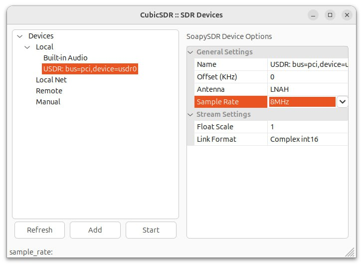
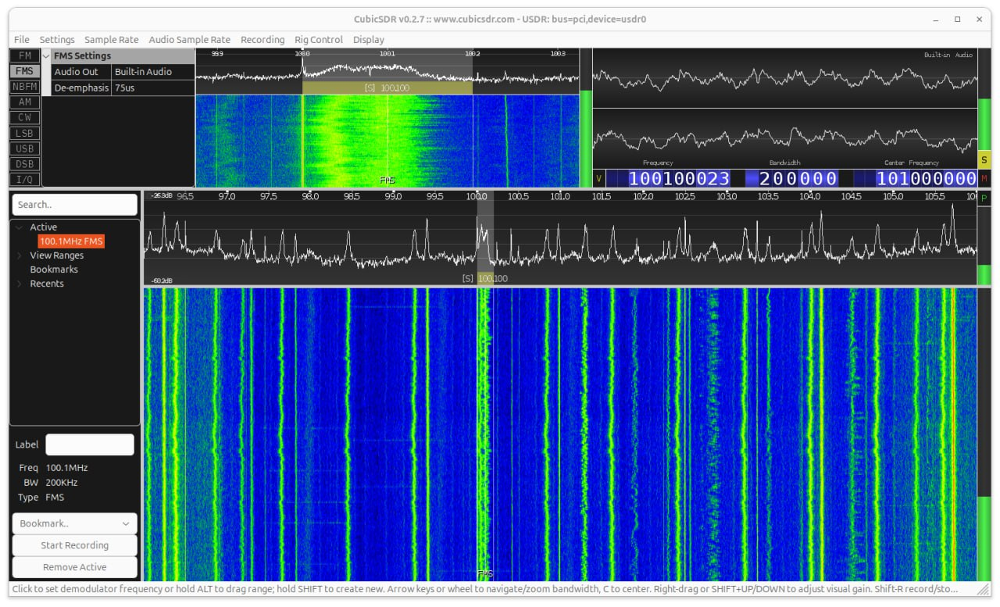

========
CubicSDR
========

Installation
------------

.. note::

   This application needs SoapySDR plugin. Please refer :doc:`/software/install` for installation instructions.

.. code-block:: bash

   sudo apt install cubicsdr

Usage
-----

Run the application and select USDR device from the list of available devices.

Start processing you will see the spectrum of the signal.
There you will able to tune and decode signals with several modulation types.

References
----------

* `CubicSDR website <https://cubicsdr.com>`_
