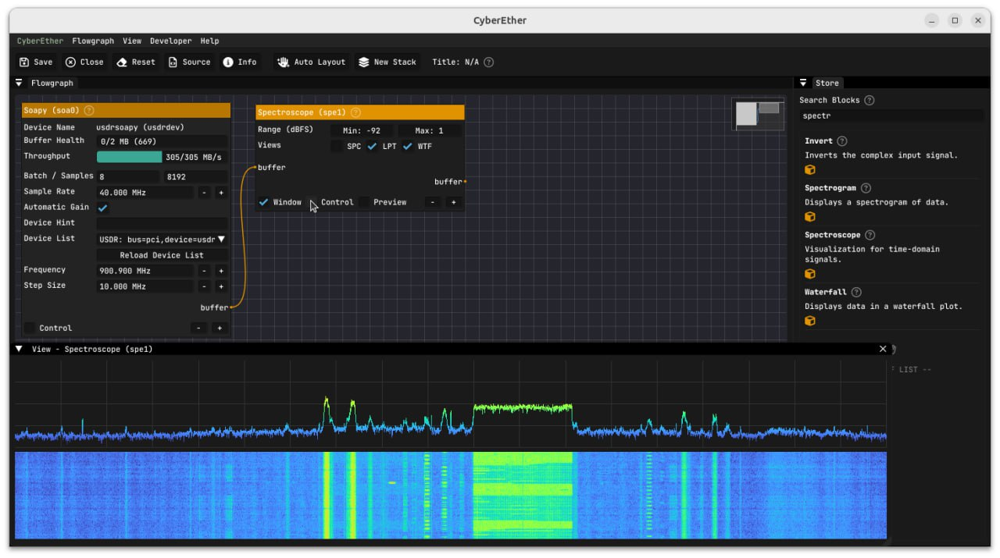

==========
CyberEther
==========

Installation
------------

.. note::

   This application needs a SoapySDR plugin. Please refer to :doc:`/software/install`.

You need to build CyberEther from source with SoapySDR support.

Usage
-----

* Create a new floatgraph.
* Place ``Soapy`` block to the graph and select USDR from the device list.
* Place ``Scectroscope`` block to the graph. Set the Range Min parameter to -100.
* Connect the blocks together.

* You should be able to see the signal spectrum.

References
----------

* `CyberEther github <https://github.com/luigifcruz/CyberEther>`_
