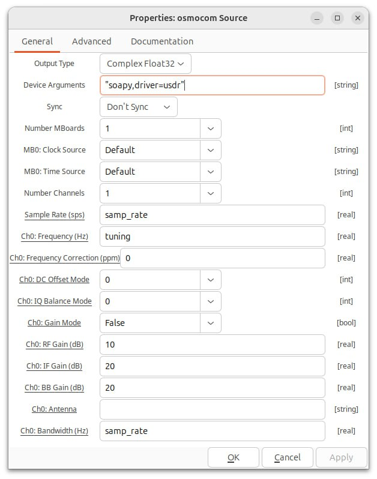
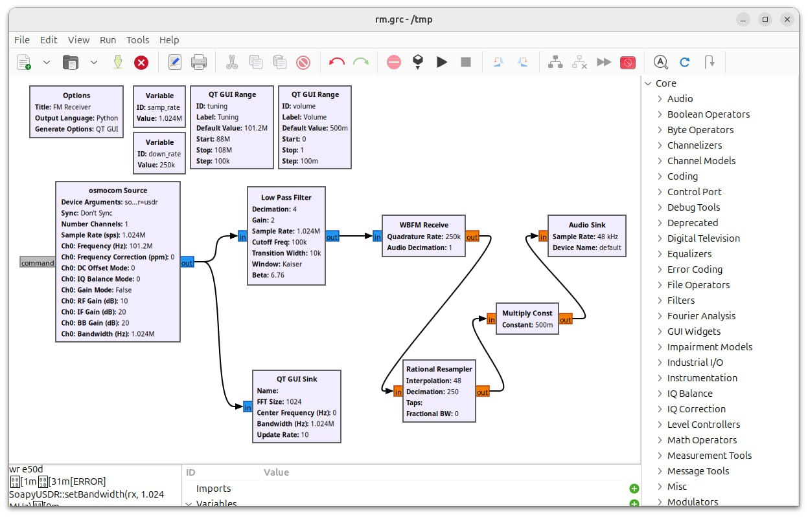
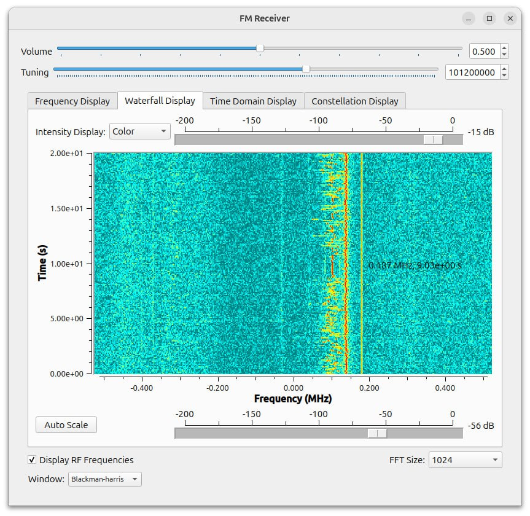

========
GNURadio
========

Installation
------------

.. note::

   This application needs SoapySDR plugin. Please refer to :doc:`/software/install`.

.. code-block:: bash

   sudo apt install gnuradio

Usage
-----

In order to use USDR with GNURadio, you have to use the "Osmocom Source" block with the following "Device Arguments".

.. code-block:: text

   "soapy,driver=usdr"

Now you can create a simple FM receiver and start listening to the radio.

You can download the example file :download:`here <../_static/applications/gnuradio_example_1.grc>`.

References
----------

* `GNURadio website <https://www.gnuradio.org>`_
