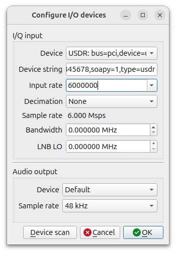
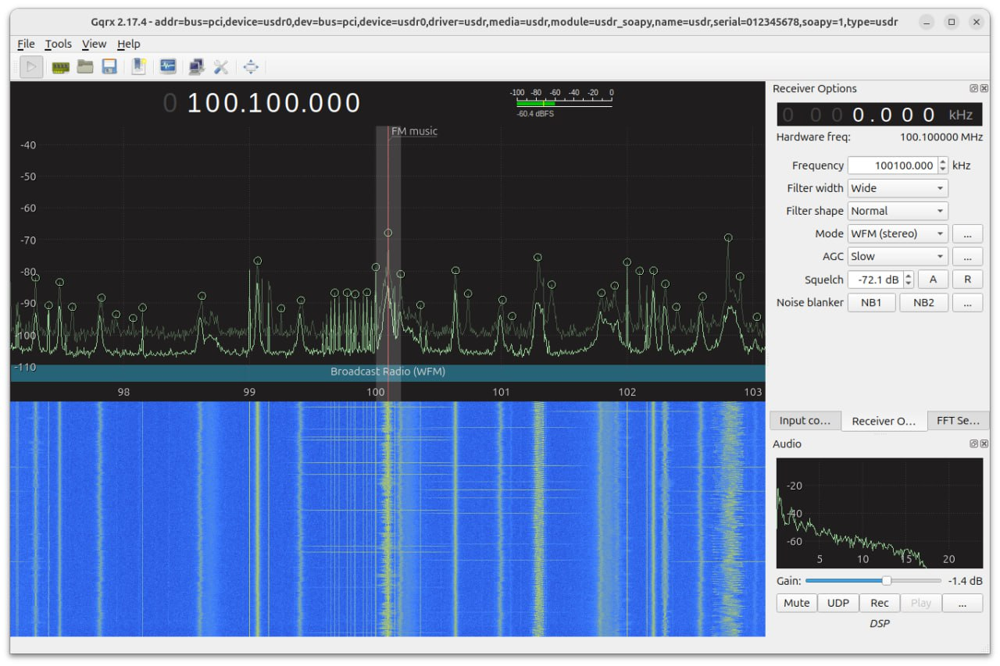

====
Gqrx
====

Installation
------------

.. note::

   This application needs a SoapySDR plugin. Please refer to :doc:`/software/install`.

.. code-block:: bash

   sudo apt install gqrx-sdr
   volk_profile

Usage
-----

* Run the application and go to File->I/O Devices.
* Click "Device scan" button.
* Select USDR device from the list of available devices.
* Enter the input rate which is effectively the sample rate. For instance, 6000000 for 6Msps.
* Make sure to set LNB LO to zero.

* Start processing you will see the spectrum of the signal.

There you will able to tune and decode signals with various modulation types.

References
----------

* `Gqrx website <https://www.gqrx.dk>`_
