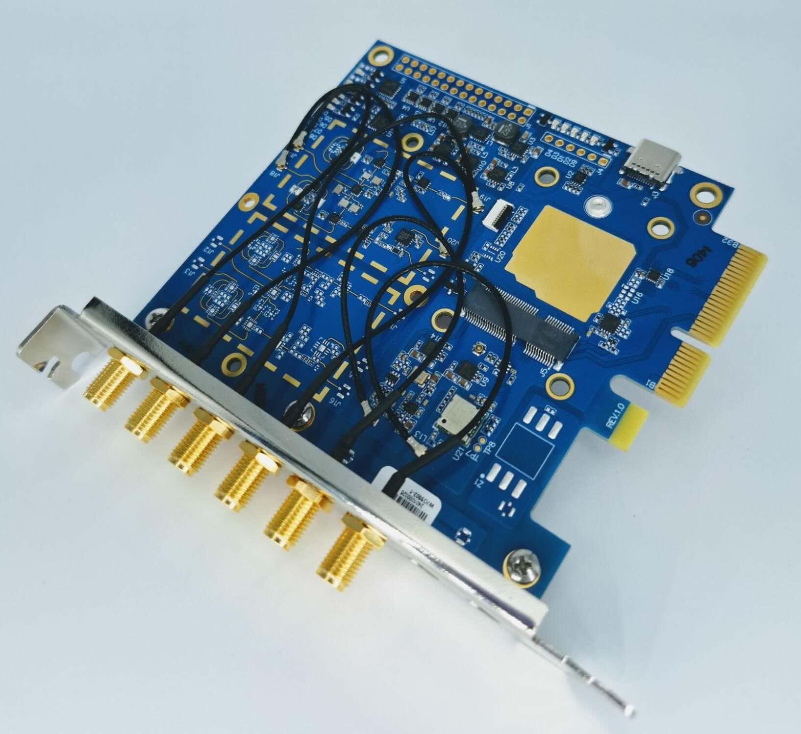
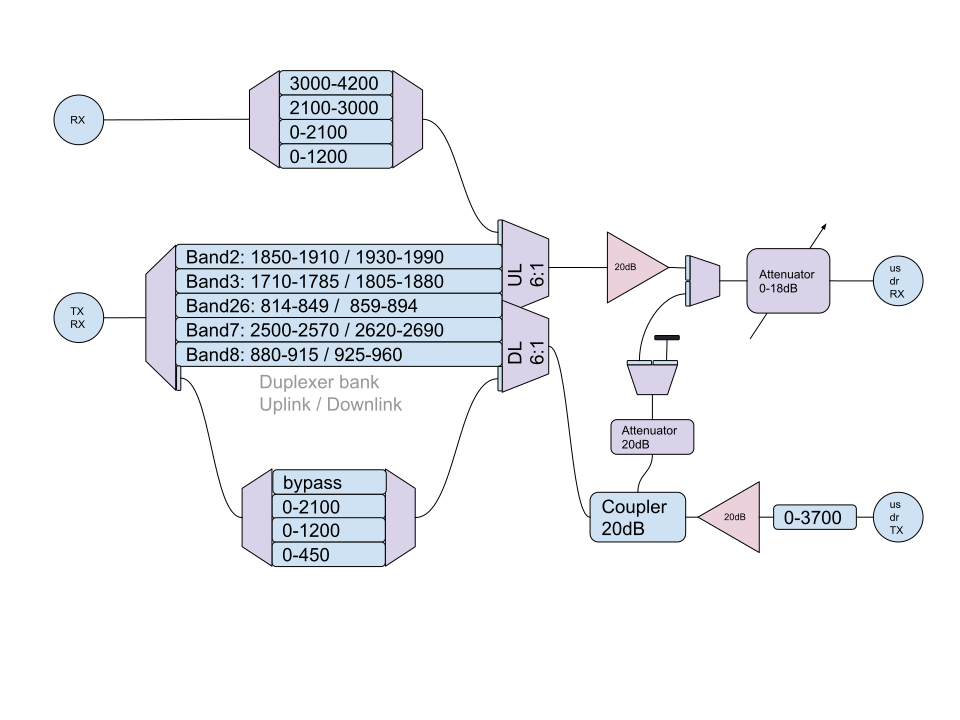
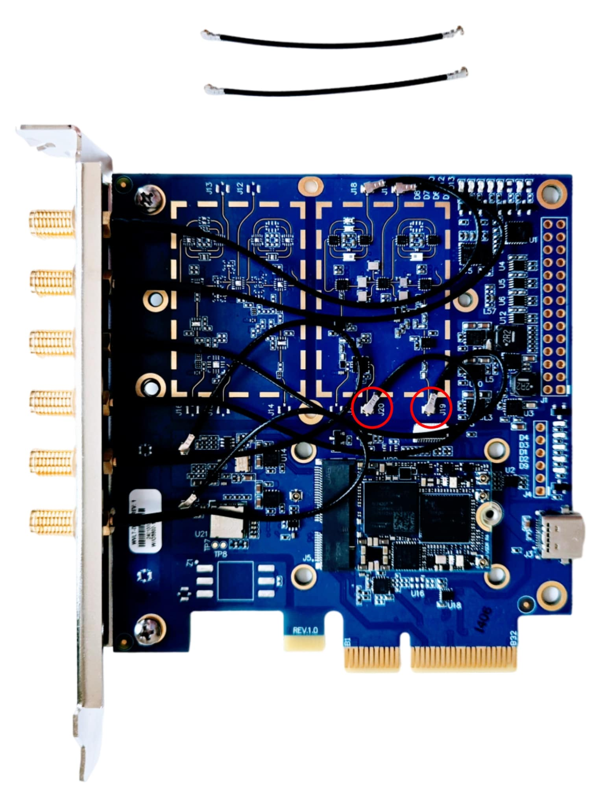
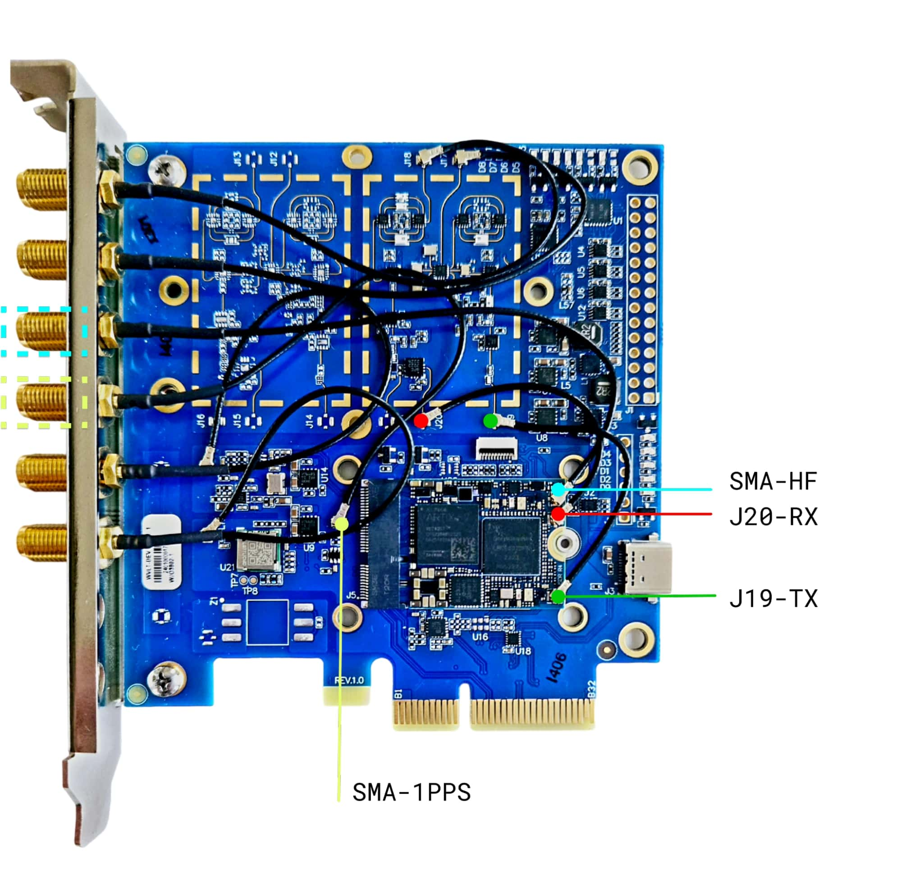
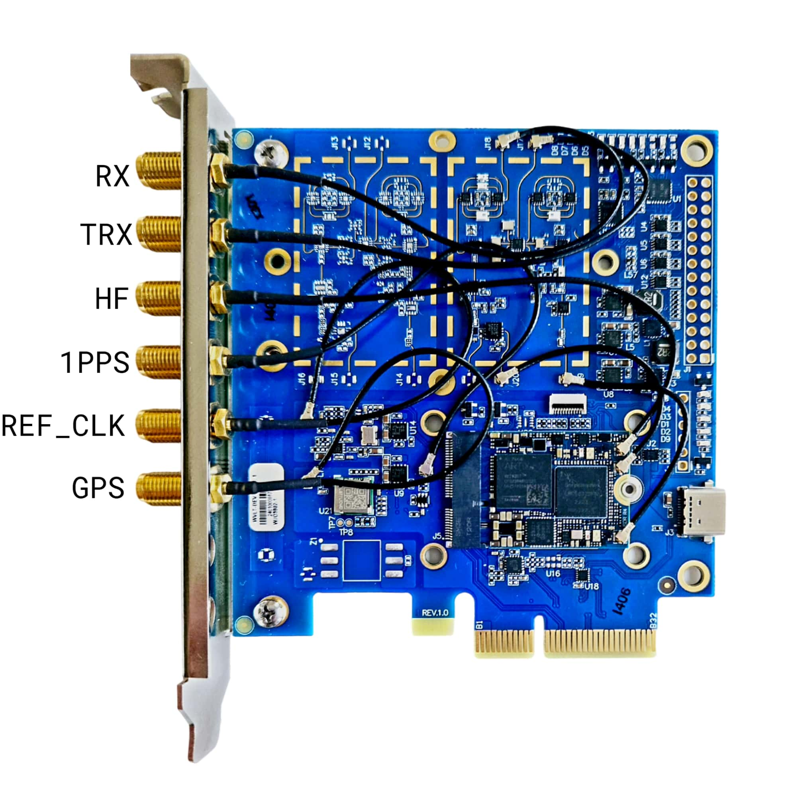

=================
Development Board
=================

The development board is intended for developers and advanced users. It features USB Type-C connectors and can be connected to a computer via a PCIe x4 slot

Features
--------

* Simple Radio Frontend: Facilitates prototyping in the 2.4-GHz ISM band
* Cellular Band Duplexer: Supports common cellular frequency bands.
* Enhanced TRX Power
* Improved RX Sensitivity
* Extended Automatic Gain Control (AGC)
* Precision Clock Synchronization: Synchronization via a GNSS module.
* Mounting Options: Includes mounting holes for a heatsink or enclosure.

Technical Specifications
------------------------

* GPSDO: GNSS module + 12-bit DAC for VCTCXO
* GPIO: 12 GPIOs in six banks with different voltage levels (1.8 - 5 V)
* USB Type-C: 5 V, 3 A (USB 3.0 lines routed, currently without gateware support)
* RF filters:
    * 3.0 - 3.8 GHz
    * 2.1 - 3.0 GHz (ISM, Wi-Fi, Bluetooth, Zigbee)
    * 0 - 2.1 GHz
    * 0 - 1.2 GHz
* TX filters:
    * 0 - 3.8 GHz
    * 0 - 2.1 GHz
    * 0 - 1.2 GHz
* LNA/PGA: MiniCircuits PGA-103+

Installation
------------

The development board comes with a factory setup after testing.
To use the full potential of the board, some cable re-routing needs to be applied.

* Plug in the uSDR using a thin thermal interface in between.
* Gently unplug the cables from connectors J20 and J19.

* Use your MHF4 - MHF4 jumpers to connect the uSDR RX/TX to J20 and J19.
* The two available SMA cables can be plugged into the uSDR HF connector and the 1PPS connector (see the picture).

* Apply a thicker thermal interface (2.0 mm) and the heatsink as described in the :doc:`/guides/heatsink` chapter.
* Here is the final SMA schematic on the panel.

.. note::

    If you don’t need to use the development board,
    you can route SMA cables directly to the uSDR connectors in the order you want.

Reference clock
---------------

You have several options for the reference clock source:

* uSDR's internal reference clock source: 26 MHz.
* Blue DevBoard's reference clock generator runs at 25 MHz.
* Green DevBoard's reference clock generator operates at 26 MHz.
* The reference frequency can be adjusted in range of 23 to 41 MHz.
* Connection to an external clock generator. A frequency range of 23 to 41 MHz should be used and a peak voltage of up to 3.3 V should be provided.

DevBoard additional options and settings
----------------------------------------

Your DevBoard has a set of "secret" options. You can use them for fine tuning/tweaking and get the most out of your device.

The most common way to access these options is using the ``-D`` option of the `usdr_dm_create utility <../software/usdr_dm_create.rst>`_. All the magic is in the ``fe`` variable settings. like 

.. code-block:: bash

   usdr_dm_create -Dfe=<dev_board_id><dev_board_rev>:<par1>:<par2>:..:<parN>

The correct meaning of ``fe`` is:

* dev board name - ``pciefe`` here;
* dev board revision, added without any separator;
* params separator, should be colon here;
* a colon-delimited params list.

The supported revisions are:

* ``v0``
* ``v0a``
* ``v1``

.. note::

   If the revision string is unrecognized, ``v1`` is used.

Each option is specified in a form like <name>_<suffix>, where suffix can be:

* ``on``/``en`` to enable the option;
* ``off`` to disable the option;
* <val> - option-specific value.

The complete options list:

* ``path_`` - operation mode, see belo;
* ``gps``   - on/off GPS module;
* ``osc_``  - on/off reference clock oscillator;
* ``lna_``  - on/off LNA (Low Noise Amplifier);
* ``pa_``   - on/off;
* ``dac_``  - sets;
* ``lb_``   - on/off;
* ``uart_``
* ``attn_`` - sets the value for the embedded attenuator.

Supported operation modes (``path_``):

.. code-block:: C

    // Duplexers path
    { "band2", TRX_BAND2, RX_LPF1200, TX_LPF400, EN_PA | EN_LNA },
    { "pcs", TRX_BAND2, RX_LPF1200, TX_LPF400, EN_PA | EN_LNA },
    { "gsm1900", TRX_BAND2, RX_LPF1200, TX_LPF400, EN_PA | EN_LNA },

    { "band3", TRX_BAND3, RX_LPF1200, TX_LPF400, EN_PA | EN_LNA },
    { "dcs", TRX_BAND3, RX_LPF1200, TX_LPF400, EN_PA | EN_LNA },
    { "gsm1800", TRX_BAND3, RX_LPF1200, TX_LPF400, EN_PA | EN_LNA },

    { "band5", TRX_BAND5, RX_LPF1200, TX_LPF400, EN_PA | EN_LNA },
    { "gsm850", TRX_BAND5, RX_LPF1200, TX_LPF400, EN_PA | EN_LNA },

    { "band7", TRX_BAND7, RX_LPF1200, TX_LPF400, EN_PA | EN_LNA },
    { "imte", TRX_BAND7, RX_LPF1200, TX_LPF400, EN_PA | EN_LNA },

    { "band8", TRX_BAND8, RX_LPF1200, TX_LPF400, EN_PA | EN_LNA },
    { "gsm900", TRX_BAND8, RX_LPF1200, TX_LPF400, EN_PA | EN_LNA },

    // TX-only path
    { "txlpf400", TRX_BYPASS, RX_LPF1200, TX_LPF400, EN_PA },
    { "txlpf1200", TRX_BYPASS, RX_LPF1200, TX_LPF1200, EN_PA },
    { "txlpf2100", TRX_BYPASS, RX_LPF1200, TX_LPF2100, EN_PA },
    { "txlpf4200", TRX_BYPASS, RX_LPF1200, TX_BYPASS, EN_PA },

    // RX-only path
    { "rxlpf1200", TRX_BYPASS, RX_LPF1200, TX_LPF400, EN_LNA },
    { "rxlpf2100", TRX_BYPASS, RX_LPF2100, TX_LPF400, EN_LNA },
    { "rxbpf2100_3000", TRX_BYPASS, RX_BPF2100_3000, TX_LPF400, EN_LNA },
    { "rxbpf3000_4200", TRX_BYPASS, RX_BPF3000_4200, TX_LPF400, EN_LNA },

    // TDD / half duplex modes
    { "trx0_400", TRX_BYPASS, RX_LPF1200, TX_LPF400, EN_PA | EN_LNA },
    { "trx400_1200", TRX_BYPASS, RX_LPF1200, TX_LPF1200, EN_PA | EN_LNA },
    { "trx1200_2100", TRX_BYPASS, RX_LPF2100, TX_LPF2100, EN_PA | EN_LNA },
    { "trx2100_3000", TRX_BYPASS, RX_BPF2100_3000, TX_BYPASS, EN_PA | EN_LNA },
    { "trx3000_4200", TRX_BYPASS, RX_BPF3000_4200, TX_BYPASS, EN_PA | EN_LNA },

