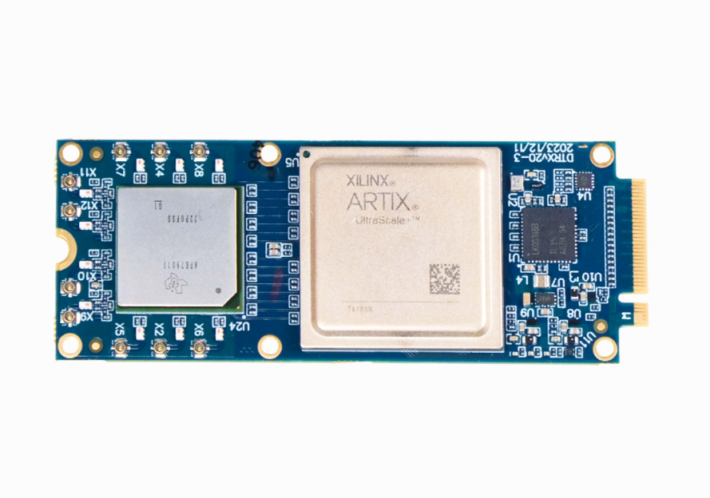

====
dSDR module
====

An M.2 advanced direct-sampling SDR with phase-coherent 6 RX and 4 TX channels. The direct sampling architecture eliminates RX/TX LO leakage and RX/TX IQ imbalance issues, providing better overall linearity, superior phase noise, a more compact design, and greater flexibility.

An M.2 embedded SDR with 6 RX / 4 TX channels and a frequency range of up to 12 GHz.

General Specifications
======================

**FPGA**  
  - AMD Artix UltraScale+ XCAU15P  

**Power Consumption**  
  - 6-15W Typical (depending on the number of active channels and bandwidth)  
  - 20W Max  

**Interface**  
  - M.2 2280 M key PCIe 4.0 x4 (with debug USB2 interface)  

**Extended Power Supply Range**  
  - 2.85 - 5.5 V  

**External Clock Synchronization**  
  - Synchronize multiple boards for a massive MIMO array  

RF Specifications
=================

**RFIC**  
  - AFE7900 / AFE7901 / AFE7950  

**Frequency Range**  
  - **Model A:** 0.4 GHz to 3.5 GHz  
  - **Model B:** 2.1 GHz to 7.2 GHz  
  - **Model C:** 3.5 GHz to 12 GHz  

**Sample Rate**  
  - 0.1 MSps - 500 MSps (up to 1 GSps on request)  

**Channel Bandwidth**  
  - 0.5 MHz - 500 MHz (up to 1 GHz on request)  

Target Applications
===================

**Cellular Communication**  
  - Enables next-generation 5G/6G wireless networks with high-order massive MIMO  
  - Fully compatible with Amarisoft and srsRAN  

**Massive MIMO Radio Link**  
  - With the dMASS synchronization board, it’s easy to build 32×32, 64×64, and larger MIMO systems  

**Embedded Applications**  
  - Develop compact and high-performance frequency analysis devices  

**Data Link**  
  - PCIe 4.0 x4 (~63 Gbit/s data rate)  

Driver and Host Libraries
=========================

- The PCIe driver is specially developed for high-speed, low-latency communication.  
- It operates primarily in user space with the ability to bypass kernel access.  
- **GPUDirect support** is in progress.  

Legacy Software Support
=======================

- GNU Radio, srsRAN, and many more through SoapySDR.
