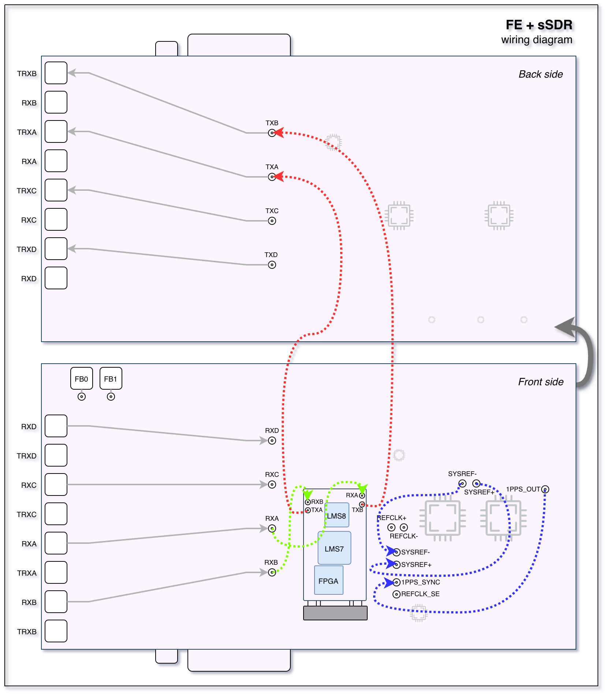
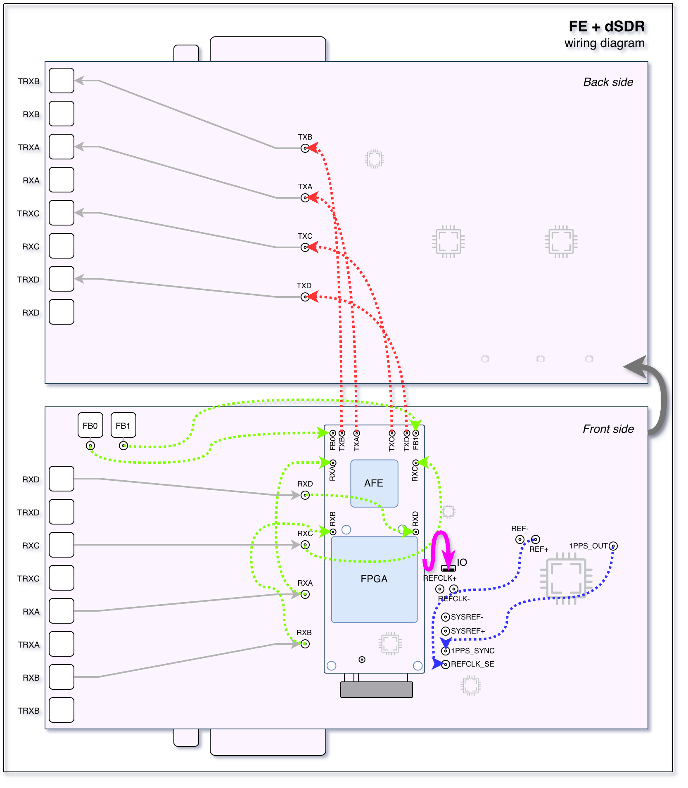
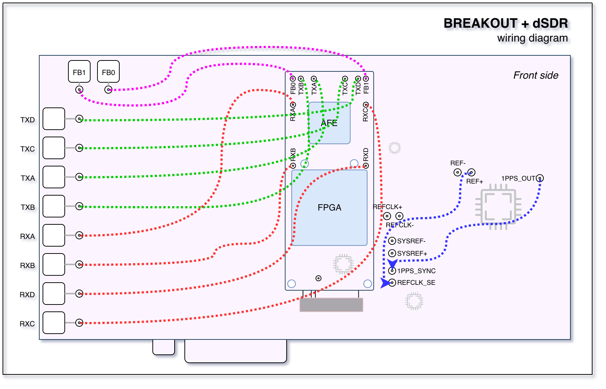
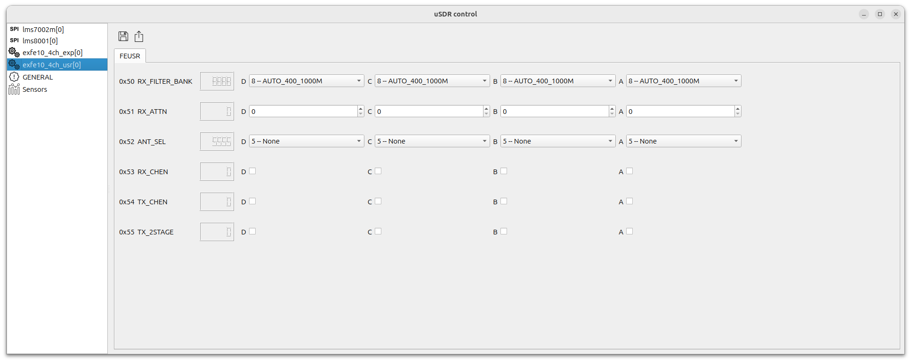
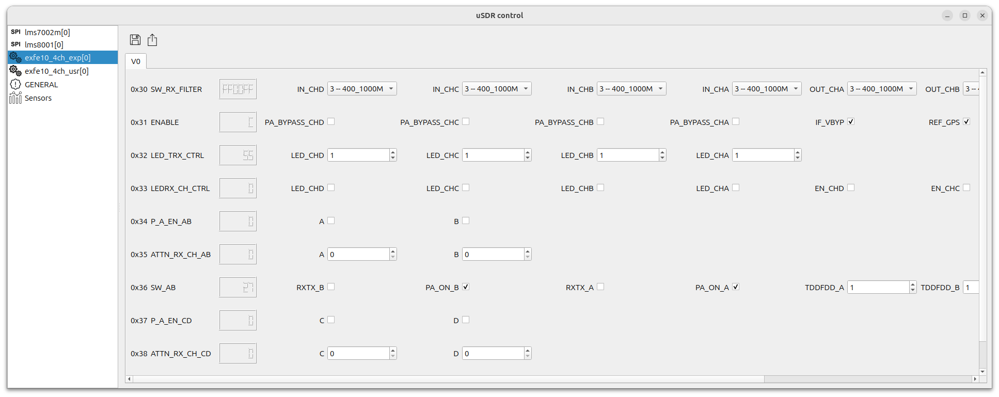

=================================
Front End (FE) and Breakout Board
=================================

A modular adapter board for sSDR and dSDR modules with an integrated high-performance RF front-end.

Overview
========

.. image:: ../_static/fe/fe_front.png
   :alt: fe sdr

.. image:: ../_static/fe/fe_back.png
   :alt: fe sdr

The Front End (FE) is a modular, high-performance adapter board featuring **4 RX and 4 TX channels** which can be synchronized.
In addition, the board includes fast TX/RX switches for each channel, making it usable for **TDD** applications.

The board can be used with our **dSDR** or **sSDR** transceiver modules.

Breakout board
--------------

The **Breakout board** is the light version of the FE board without the RF front-end components.
It is intended for users who want to design their own RF front-end or use the board in a lab environment.

.. image:: ../_static/fe/fe_breakout_front.png
   :alt: fe breakout sdr

General Specifications
----------------------

**Clock Synchronization**
  - LMK1C1104

**Module slot**
  - M.2 Key M socket for sSDR or dSDR module

**Form Factor**
  - PCIe x4

RF Specifications
-----------------

.. note::
   | The full specification of sSDR module :doc:`/hardware/ssdr`.

.. note::
   | The full specification of dSDR module :doc:`/hardware/dsdr`.

Integrated high-performance RF front-end with low-noise amplifiers, power amplifiers, filters, and switches.

**RF frontend frequency range**
  - 50 MHz to 7.2 GHz

**RFIC**
  - with sSDR module:
     - LMS7002M + LMS8001
     - 2 RX / 2 TX channels
  - with dSDR module:
     - AFE7900/AFE7901/AFE7950
     - 6 RX / 4 TX channels

**Sample Rate**
  - with sSDR module:
     - 4 MSps - 100 MSps
  - with dSDR module
     - 0.1 MSps - 500 MSps

**Channel Bandwidth**
  - with sSDR module:
     - 0.5 MHz - 90 MHz
  - with dSDR module:
     - 0.5 MHz - 500 MHz

Bifurcation Modes
-----------------

- **4×4 MIMO systems**
- **2 independent 2×2 MIMO systems**

Target Applications
-------------------

**Cellular Communication**
  - Enables next-generation **4G/5G wireless networks** with high-order **massive MIMO** and **TDD**
  - Fully compatible with **Amarisoft** and **srsRAN**

**Directional Finding**
  - Determines the **direction of arrival (DoA)** of incoming radio signals, enabling **precise localization** of transmitters

**Beamforming**
  - Focuses on signal transmission and reception in specific directions
  - Enhances range, improves signal quality, and reduces interference in multi-user environments

Connections
===========

.. note::
   | USB-C is intended solely for use in manufacturing test facilities.
   | It is not used during normal operation.

Front side
----------

The front side of the board contains the M.2 socket for the sSDR or sSDR module and 4 MHF7 connectors for RX signals.

Back side
---------

The front side of the board contains 4 MHF7 connectors for TX signals.

PCI bracket panel
-----------------

The bracket panel of the FE has 8 external SMA connectors for TX/RX/TRX signals.

sSDR module connections
-----------------------

The following schematic diagram shows the connections between the FE board and the sSDR module.

dSDR module connections
-----------------------

The following schematic diagram shows the connections between the FE board and the dSDR module.

Breakout board connections
--------------------------

The following schematic diagram shows the connections between the BreakOut board and the dSDR module.

Clocks and synchronization
==========================

There are two clock domains on the FE board:

* **REFCLK**: Reference clock used for phase synchronization and RF frequency calibration.
* **SYSREF**: Event synchronization: start, stop, and other control signals.

The FE board can use different clock sources:

* On-board crystal oscillator.
* GPS synchronization using the on-board GPS module.

sSDR wiring
-----------

* ``REF+`` to ``SYSREF+``.
* ``REF-`` to ``SYSREF-``.
* ``1PPS_OUT`` to ``1PPS_SYN``.

The following diagram shows the clock and synchronization wiring when using the sSDR module.

.. image:: ../_static/fe/fe_sync_ssdr.png
   :alt: fe ssdr clocks and synchronization block diagram

dSDR wiring
-----------

* ``REF+`` to ``REFCLK_SE``.
* ``1PPS_OUT`` to ``1PPS_SYN``.
* Connect FPC connector on the FE board(marked as ``IO`` on the schema above) to the FPC connector on the dSDR module.

The following diagram shows the clock and synchronization wiring when using the dSDR module.

.. image:: ../_static/fe/fe_sync_dsdr.png
   :alt: fe dsdr clocks and synchronization block diagram

RF distribution
===============

.. image:: ../_static/fe/fe_rf.png
   :alt: fe sdr rf distribution block diagram

.. note::
   | The diagram above shows the RF distribution for one pair of RX/TX channels.
   | The rest of the channels are connected in the same way.

sSDR module
-----------

For sSDR, the RF distribution should be connected as follows:

* ``RXA`` to ``sSDR RX A``.
* ``RXB`` to ``sSDR RX B``.
* ``TXA`` to ``sSDR TX A``.
* ``TXB`` to ``sSDR TX B``.

.. note::
   | sSDR only has 2 RX and 2 TX channels, so only the first two pairs are used.

dSDR module
-----------

For dSDR, the RF distribution should be connected as follows:

* ``RXA`` to ``dSDR RX A``.
* ``RXB`` to ``dSDR RX B``.
* ``RXC`` to ``dSDR RX C``.
* ``RXD`` to ``dSDR RX D``.
* ``TXA`` to ``dSDR TX A``.
* ``TXB`` to ``dSDR TX B``.
* ``TXC`` to ``dSDR TX C``.
* ``TXD`` to ``dSDR TX D``.

Calibration
-----------

The loopback mode is possible for each TX/RX pair for calibration purposes.

RF frontend control
===================

.. note::
   | In order to control the frontend from software, you need to use the ``usdr_registers`` tool.
   | Please refer to the :doc:`/software/usdr_registers`.

exfe10_4ch_usr
--------------

This section describes the main register map for controlling the FE front-end.
Using controls on this page, you can switch filters, set attenuators, select antenna paths, and enable/disable channels.

   FE control registers

* - ``RX_FILTER_BANK``/``A`` - RX filter bank selector for channel A
  - Options:

        - ``FILT_50_1000M`` - RX filter 50-1000 MHz
        - ``FILT_1000_2000M`` - RX filter 1000-2000 MHz
        - ``FILT_2000_3500M`` - RX filter 2000-3500 MHz
        - ``FILT_2500_5000M`` - RX filter 2500-5000 MHz
        - ``FILT_3500_7100M`` - RX filter 3500-7100 MHz
        - ``AUTO_50_1000M`` - Sets filter automatically by LO frequency / Shows selected filter when in AUTO mode
        - ``AUTO_1000_2000M`` - Sets filter automatically by LO frequency / Shows selected filter when in AUTO mode
        - ``AUTO_2000_3500M`` - Sets filter automatically by LO frequency / Shows selected filter when in AUTO mode
        - ``AUTO_2500_5000M`` - Sets filter automatically by LO frequency / Shows selected filter when in AUTO mode
        - ``AUTO_3500_7100M`` - Sets filter automatically by LO frequency / Shows selected filter when in AUTO mode

* - ``RX_FILTER_BANK``/``B`` - RX filter bank selector for channel B
  - Options: same as channel A

* - ``RX_FILTER_BANK``/``C`` - RX filter bank selector for channel C
  - Options: same as channel A

* - ``RX_FILTER_BANK``/``D`` - RX filter bank selector for channel D
  - Options: same as channel A

* - ``RX_ATTN``/``A`` - RX attenuator setting (dB) for channel A

* - ``RX_ATTN``/``B`` - RX attenuator setting (dB) for channel B

* - ``RX_ATTN``/``C`` - RX attenuator setting (dB) for channel C

* - ``RX_ATTN``/``D`` - RX attenuator setting (dB) for channel D

* - ``ANT_SEL``/``A`` - Antenna path selector for channel A
  - Options:

        - ``RX_TO_RX_AND_TX_TO_TRX`` - RX to RX path and TX to TRX path
        - ``RX_TO_TRX_AND_TX_TERM`` - RX to TRX path and TX terminated
        - ``RX_TO_RX_AND_TX_TERM`` - RX to RX path and TX terminated
        - ``RX_TX_LOOPBACK`` - RX to TX loopback
        - ``TDD_DRIVEN_AUTO`` - Automatic TDD mode

* - ``ANT_SEL``/``B`` - Antenna path selector for channel B
  - Options: same as channel A

* - ``ANT_SEL``/``C`` - Antenna path selector for channel C
  - Options: same as channel A

* - ``ANT_SEL``/``D`` - Antenna path selector for channel D
  - Options: same as channel A

* - ``RX_CHEN``/``A`` - Enable RX channel A

* - ``RX_CHEN``/``B`` - Enable RX channel B

* - ``RX_CHEN``/``C`` - Enable RX channel C

* - ``RX_CHEN``/``D`` - Enable RX channel D

* - ``TX_CHEN``/``A`` - Enable TX channel A

* - ``TX_CHEN``/``B`` - Enable TX channel B

* - ``TX_CHEN``/``C`` - Enable TX channel C

* - ``TX_CHEN``/``D`` - Enable TX channel D

* - ``TX_2STAGE``/``A`` - Enable TX 2nd stage for channel A

* - ``TX_2STAGE``/``B`` - Enable TX 2nd stage for channel B

* - ``TX_2STAGE``/``C`` - Enable TX 2nd stage for channel C

* - ``TX_2STAGE``/``D`` - Enable TX 2nd stage for channel D

exfe10_4ch_exp
--------------

This section describes the low level control register map for the FE front-end.
Using this page, you can control each hardware component directly.

.. warning::
   | The page exposes the low-level hardware controls.
   | Improper use may lead to unexpected behavior or damage to your hardware.

   FE control lowlevel registers

* - ``SW_RX_FILTER``/``IN_CHA`` - RX IN filters switch for Channel A
  - Options:

        - ``MUTE0`` - Mute / Disconnected
        - ``50_1000M`` - Input filter bank switch to filter 50-1000 MHz
        - ``1000_2000M`` - Input filter bank switch to filter 1000-2000 MHz
        - ``2000_3500M`` - Input filter bank switch to filter 2000-3500 MHz
        - ``2500_5000M`` - Input filter bank switch to filter 2500-5000 MHz
        - ``3500_7100M`` - Input filter bank switch to filter 3500-7100 MHz
        - ``MUTE1`` - Mute / Disconnected
        - ``MUTE2`` - Mute / Disconnected

* - ``SW_RX_FILTER``/``OUT_CHA`` - RX OUT filters switch for Channel A
  - Options:

        - ``MUTE0`` - Mute / Disconnected
        - ``50_1000M`` - Output filter bank switch to filter 50-1000 MHz
        - ``1000_2000M`` - Output filter bank switch to filter 1000-2000 MHz
        - ``2000_3500M`` - Output filter bank switch to filter 2000-3500 MHz
        - ``2500_5000M`` - Output filter bank switch to filter 2500-5000 MHz
        - ``3500_7100M`` - Output filter bank switch to filter 3500-7100 MHz
        - ``MUTE1`` - Mute / Disconnected
        - ``MUTE2`` - Mute / Disconnected

* - ``SW_RX_FILTER``/``IN_CHB`` - RX IN filters switch for Channel B
  - Options: same as Channel A

* - ``SW_RX_FILTER``/``OUT_CHB`` - RX OUT filters switch for Channel B
  - Options: same as Channel A

* - ``SW_RX_FILTER``/``IN_CHC`` - RX IN filters switch for Channel C
  - Options: same as Channel A

* - ``SW_RX_FILTER``/``OUT_CHC`` - RX OUT filters switch for Channel C
  - Options: same as Channel A

* - ``SW_RX_FILTER``/``IN_CHD`` - RX IN filters switch for Channel D
  - Options: same as Channel A

* - ``SW_RX_FILTER``/``OUT_CHD`` - RX OUT filters switch for Channel D
  - Options: same as Channel A

* - ``ENABLE``/``IF_VBYP`` - IF bypass control

* - ``ENABLE``/``REF_GPS`` - Enable GPS module

* - ``ENABLE``/``P8V_TX`` - Enable +8V power supply for TX amps

* - ``ENABLE``/``P6V_RX`` - Enable +6V power supply for RX amps

* - ``ENABLE``/``PA_BYPASS_CHD`` - Stage-2 PA bypass, channel D

* - ``ENABLE``/``PA_BYPASS_CHC`` - Stage-2 PA bypass, channel C

* - ``ENABLE``/``PA_BYPASS_CHB`` - Stage-2 PA bypass, channel B

* - ``ENABLE``/``PA_BYPASS_CHA`` - Stage-2 PA bypass, channel A

* - ``LED_TRX_CTRL``/``LED_CHA`` - LED TX/RX control for Channel A

* - ``LED_TRX_CTRL``/``LED_CHB`` - LED TX/RX control for Channel B

* - ``LED_TRX_CTRL``/``LED_CHC`` - LED TX/RX control for Channel C

* - ``LED_TRX_CTRL``/``LED_CHD`` - LED TX/RX control for Channel D

* - ``LEDRX_CH_CTRL``/``EN_CHA`` - Enable LED CHA

* - ``LEDRX_CH_CTRL``/``EN_CHB`` - Enable LED CHB

* - ``LEDRX_CH_CTRL``/``EN_CHC`` - Enable LED CHC

* - ``LEDRX_CH_CTRL``/``EN_CHD`` - Enable LED CHD

* - ``LEDRX_CH_CTRL``/``LED_CHA`` - LED CHA indicator

* - ``LEDRX_CH_CTRL``/``LED_CHB`` - LED CHB indicator

* - ``LEDRX_CH_CTRL``/``LED_CHC`` - LED CHC indicator

* - ``LEDRX_CH_CTRL``/``LED_CHD`` - LED CHD indicator

* - ``P_A_EN_AB``/``B`` - Enable CHB (PA enable AB)

* - ``P_A_EN_AB``/``A`` - Enable CHA (PA enable AB)

* - ``ATTN_RX_CH_AB``/``B`` - Attenuator CHB

* - ``ATTN_RX_CH_AB``/``A`` - Attenuator CHA

* - ``SW_AB``/``TDDFDD_A`` - TDD/FDD control bits (A)

* - ``SW_AB``/``TDDFDD_B`` - TDD/FDD control bits (B)

* - ``SW_AB``/``PA_ON_A`` - PA on control for A

* - ``SW_AB``/``PA_ON_B`` - PA on control for B

* - ``SW_AB``/``RXTX_A`` - RX/TX switch control for A

* - ``SW_AB``/``RXTX_B`` - RX/TX switch control for B

* - ``P_A_EN_CD``/``D`` - Enable CHD (PA enable CD)

* - ``P_A_EN_CD``/``C`` - Enable CHC (PA enable CD)

* - ``ATTN_RX_CH_CD``/``D`` - Attenuator CHD

* - ``ATTN_RX_CH_CD``/``C`` - Attenuator CHC

* - ``SW_CD``/``TDDFDD_C`` - TDD/FDD control bits (C)

* - ``SW_CD``/``TDDFDD_D`` - TDD/FDD control bits (D)

* - ``SW_CD``/``PA_ON_C`` - PA on control for C

* - ``SW_CD``/``PA_ON_D`` - PA on control for D

* - ``SW_CD``/``RXTX_C`` - RX/TX switch control for C

* - ``SW_CD``/``RXTX_D`` - RX/TX switch control for D

.. Commented out

    Measurements
    ============

    This section contains measurements for the RF paths on the FE board.

    .. figure:: ../_static/fe/graphs/RX_50_1000MHz_0dB.png
       :alt: rx 50-1000mhz, 0db measurement

       Parameters of RX path with 50-1000MHz filter at 0dB attenuation

    .. figure:: ../_static/fe/graphs/RX_50_1000MHz_1dB.png
       :alt: rx 50-1000mhz, 1db measurement

       Parameters of RX path with 50-1000MHz filter at 1dB attenuation

    .. figure:: ../_static/fe/graphs/RX_50_1000MHz_2dB.png
       :alt: rx 50-1000mhz, 2db measurement

       Parameters of RX path with 50-1000MHz filter at 2dB attenuation

    .. figure:: ../_static/fe/graphs/RX_50_1000MHz_4dB.png
       :alt: rx 50-1000mhz, 4db measurement

       Parameters of RX path with 50-1000MHz filter at 4dB attenuation

    .. figure:: ../_static/fe/graphs/RX_50_1000MHz_8dB.png
       :alt: rx 50-1000mhz, 8db measurement

       Parameters of RX path with 50-1000MHz filter at 8dB attenuation

    .. figure:: ../_static/fe/graphs/RX_50_1000MHz_15dB.png
       :alt: rx 50-1000mhz, 15db measurement

       Parameters of RX path with 50-1000MHz filter at 15dB attenuation

    .. figure:: ../_static/fe/graphs/RX_1000_2000MHz_15dB.png
       :alt: rx 1000-2000mhz, 15db measurement

       Parameters of RX path with 1000-2000MHz filter at 15dB attenuation

    .. figure:: ../_static/fe/graphs/ATTENUATION_RXA_50_1000MHz.png
       :alt: attenuation rxa 50-1000mhz

       Attenuation characteristics for RX channel A with 50-1000MHz filter

    .. figure:: ../_static/fe/graphs/ATTENUATION_RXB_50_1000MHz.png
       :alt: attenuation rxb 50-1000mhz

       Attenuation characteristics for RX channel B with 50-1000MHz filter

    .. figure:: ../_static/fe/graphs/ATTENUATION_RXC_50_1000MHz.png
       :alt: attenuation rxc 50-1000mhz

       Attenuation characteristics for RX channel C with 50-1000MHz filter

    .. figure:: ../_static/fe/graphs/ATTENUATION_RXD_50_1000MHz.png
       :alt: attenuation rxd 50-1000mhz

       Attenuation characteristics for RX channel D with 50-1000MHz filter

    .. figure:: ../_static/fe/graphs/RX_2000_3500MHz_15dB.png
       :alt: rx 2000-3500mhz, 15db measurement

       Parameters of RX path with 2000-3500MHz filter at 15dB attenuation

    .. figure:: ../_static/fe/graphs/RX_2500_5000MHz_15dB.png
       :alt: rx 2500-5000mhz, 15db measurement

       Parameters of RX path with 2500-5000MHz filter at 15dB attenuation

    .. figure:: ../_static/fe/graphs/RX_3500_7100MHz_15dB.png
       :alt: rx 3500-7100mhz, 15db measurement

       Parameters of RX path with 3500-7100MHz filter at 15dB attenuation

    .. figure:: ../_static/fe/graphs/TRX.png
       :alt: trx measurement

       Parameters of TRX path

    .. figure:: ../_static/fe/graphs/TRX_2STAGE.png
       :alt: trx 2stage measurement

       Parameters of TRX path with 2-stage PA

Software
========

..
    .. note::
       | You must install the required software and driver packages first.
       | Please refer to the :doc:`/software/install`.

.. caution::
   | A newer version of software is required!
   |
   | - :doc:`Build the software from source </software/compile>` using ``feature_pe_sync`` branch.
   | - Install the SoapySDR plugin.
   | - Once everything is installed, open any SoapySDR-compatible app like CubicSDR select the SDR device, keep parameters as it is, only make sure that the sample rate is not less than 8MHz, and you can begin tuning frequencies and viewing the RF spectrum. Or you can test with :doc:`/software/usdr_dm_create`.

In order to use FE, you can use the **usdr_dm_create** utility to receive or transmit data.

The following example creates a raw IQ data file with a sample rate of 10 MSamples per second per channel, a center frequency of 1700 MHz, using all 4 RX channels:

.. code-block:: bash

   usdr_dm_create -D -r10e6 -l3 -e1700e6 -c -1 -f output.raw

The software stack supports the **SoapySDR** interface, so you can use any compatible application.
