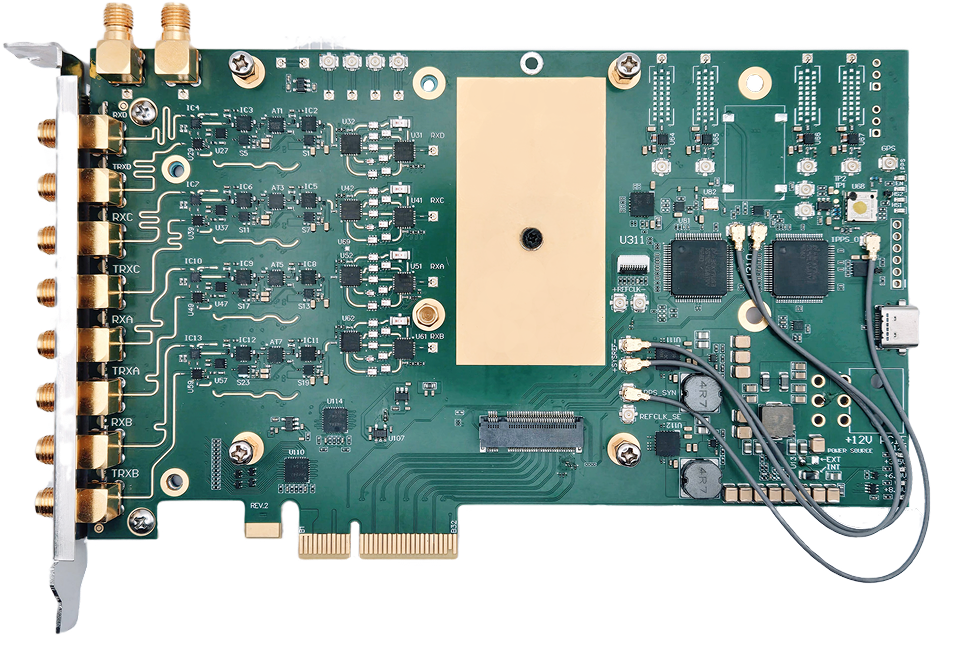
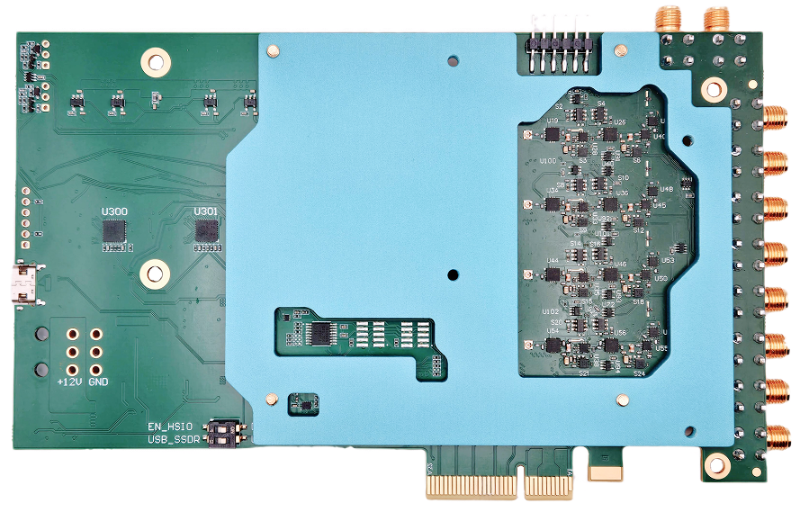
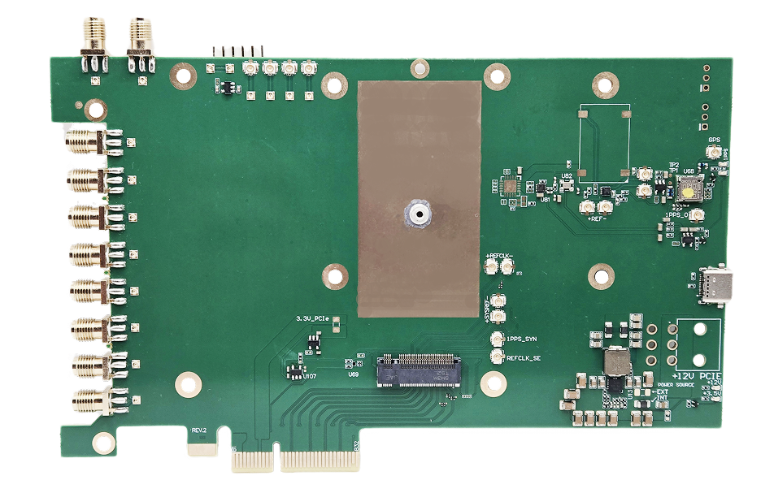
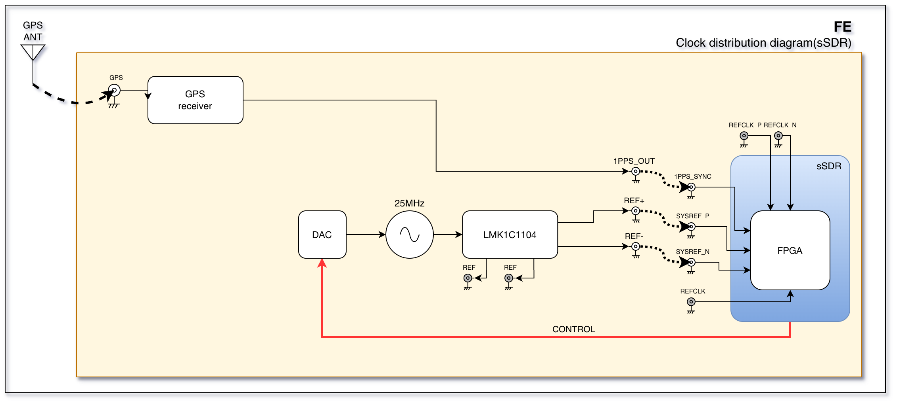
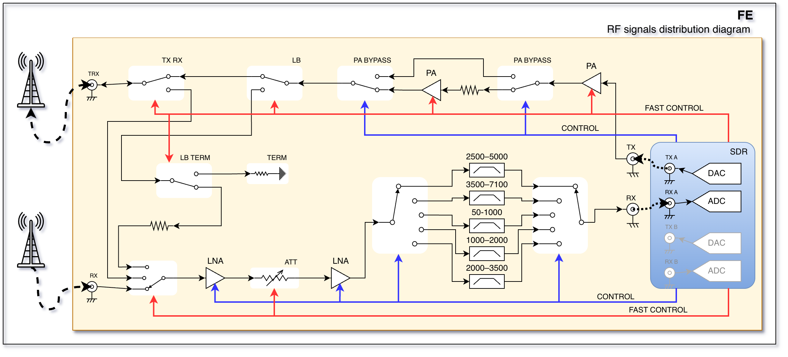
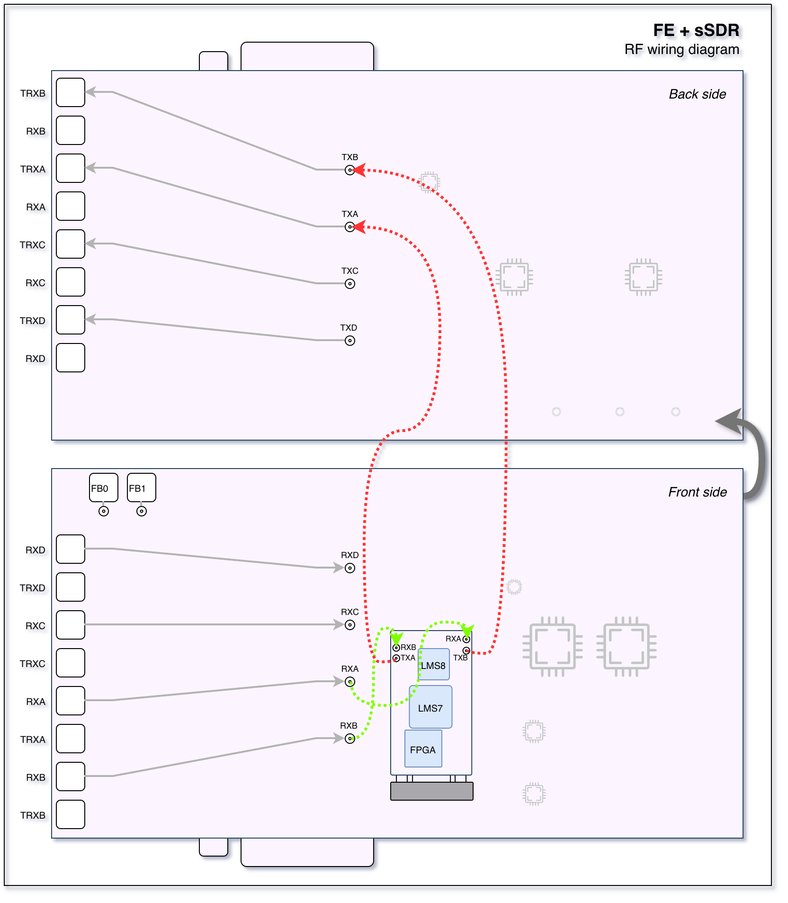
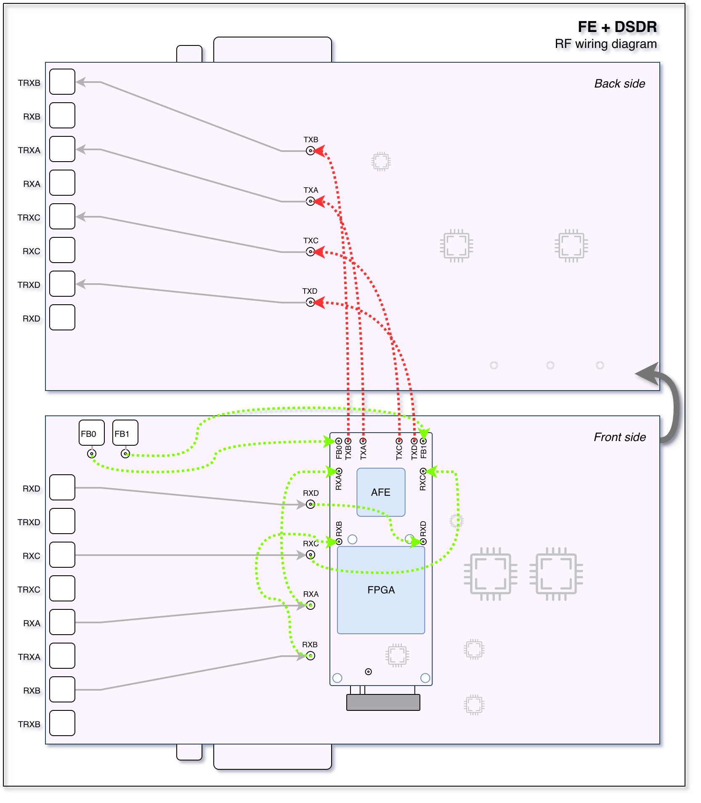

=================================
Front End (FE) and Breakout Board
=================================

A modular adapter board for sSDR and dSDR modules with an integrated high-performance RF front-end.

Overview
========

The Front End (FE) is a modular, high-performance adapter board featuring **4 RX and 4 TX channels** which can be synchronized.
In addition, the board includes fast TX/RX switches for each channel, making it usable for **TDD** applications.

The board can be used with our **dSDR** or **sSDR** transceiver modules.

Breakout board
--------------

The **Breakout board** is the light version of the FE board without the RF front-end components.
It is intended for users who want to design their own RF front-end or use the board in a lab environment.

General Specifications
----------------------

**Clock Synchronization**
  - LMK1C1104

**Module slot**
  - M.2 Key M socket for sSDR or dSDR module

**Form Factor**
  - PCIe x4

RF Specifications
-----------------

.. note::
   | The full specification of sSDR module :doc:`/hardware/ssdr`.

.. note::
   | The full specification of dSDR module :doc:`/hardware/dsdr`.

Integrated high-performance RF front-end with low-noise amplifiers, power amplifiers, filters, and switches.

**RF frontend frequency range**
  - 400 MHz to 12 GHz

**RFIC**
  - with sSDR module:
     - LMS7002M + LMS8001
     - 2 RX / 2 TX channels
  - with dSDR module:
     - AFE7900/AFE7901/AFE7950
     - 6 RX / 4 TX channels

**Frequency Range**
  - with sSDR module:
     - 30 MHz to 11 GHz
  - with dSDR module:
     - Model XXXX: 10 MHz to 12 GHz (See the dSDR module page for reference)

**Sample Rate**
  - with sSDR module:
     - 4 MSps - 100 MSps
  - with dSDR module
     - 0.1 MSps - 500 MSps

**Channel Bandwidth**
  - with sSDR module:
     - 0.5 MHz - 90 MHz
  - with dSDR module:
     - 0.5 MHz - 500 MHz

Bifurcation Modes
-----------------

- **4×4 MIMO systems**
- **2 independent 2×2 MIMO systems**

Target Applications
-------------------

**Cellular Communication**
  - Enables next-generation **4G/5G wireless networks** with high-order **massive MIMO** and **TDD**
  - Fully compatible with **Amarisoft** and **srsRAN**

**Directional Finding**
  - Determines the **direction of arrival (DoA)** of incoming radio signals, enabling **precise localization** of transmitters

**Beamforming**
  - Focuses on signal transmission and reception in specific directions
  - Enhances range, improves signal quality, and reduces interference in multi-user environments

Connections
===========

.. note::
   | USB-C is intended solely for use in manufacturing test facilities.
   | It is not used during normal operation.

Front side
----------

The front side of the board contains the M.2 socket for the sSDR or sSDR module and 4 MHF7 connectors for RX signals.

Back side
---------

The front side of the board contains 4 MHF7 connectors for TX signals.

PCI bracket panel
-----------------

The bracket panel of the FE has 8 external SMA connectors for TX/RX/TRX signals.

Clocks and synchronization
==========================

There are two clock domains on the FE board:

* **REFCLK**: Reference clock used for phase synchronization and RF frequency calibration.
* **SYSREF**: Event synchronization: start, stop, and other control signals.

The FE board can use different clock sources:

* On-board crystal oscillator.
* GPS synchronization using the on-board GPS module.

sSDR wiring
-----------

* ``REF+`` to ``SYSREF+``.
* ``REF-`` to ``SYSREF-``.
* ``1PPS_OUT`` to ``1PPS_SYN``.

The following diagram shows the clock and synchronization wiring when using the sSDR module.

dSDR wiring
-----------

* ``REF+`` to ``REFCLK_SE``.
* ``1PPS_OUT`` to ``1PPS_SYN``.

The following diagram shows the clock and synchronization wiring when using the dSDR module.

RF distribution
===============

.. note::
   | The diagram above shows the RF distribution for one pair of RX/TX channels.
   | The rest of the channels are connected in the same way.

sSDR module
-----------

For sSDR, the RF distribution should be connected as follows:

* ``RXA`` to ``sSDR RX A``.
* ``RXB`` to ``sSDR RX B``.
* ``TXA`` to ``sSDR TX A``.
* ``TXB`` to ``sSDR TX B``.

.. note::
   | sSDR only has 2 RX and 2 TX channels, so only the first two pairs are used.

dSDR module
-----------

For dSDR, the RF distribution should be connected as follows:

* ``RXA`` to ``dSDR RX A``.
* ``RXB`` to ``dSDR RX B``.
* ``RXC`` to ``dSDR RX C``.
* ``RXD`` to ``dSDR RX D``.
* ``TXA`` to ``dSDR TX A``.
* ``TXB`` to ``dSDR TX B``.
* ``TXC`` to ``dSDR TX C``.
* ``TXD`` to ``dSDR TX D``.

Calibration
-----------

The loopback mode is possible for each TX/RX pair for calibration purposes.

Software
========

.. note::
   | You must install the required software and driver packages first.
   | Please refer to the :doc:`/software/install`.

In order to use FE, you can use the **usdr_dm_create** utility to receive or transmit data.

The following example creates a raw IQ data file with a sample rate of 10 MSamples per second per channel, a center frequency of 1700 MHz, using all 4 RX channels:

.. code-block:: bash

   usdr_dm_create -D -r10e6 -l3 -e1700e6 -c -1 -f output.raw

The software stack supports the **SoapySDR** interface, so you can use any compatible application.
