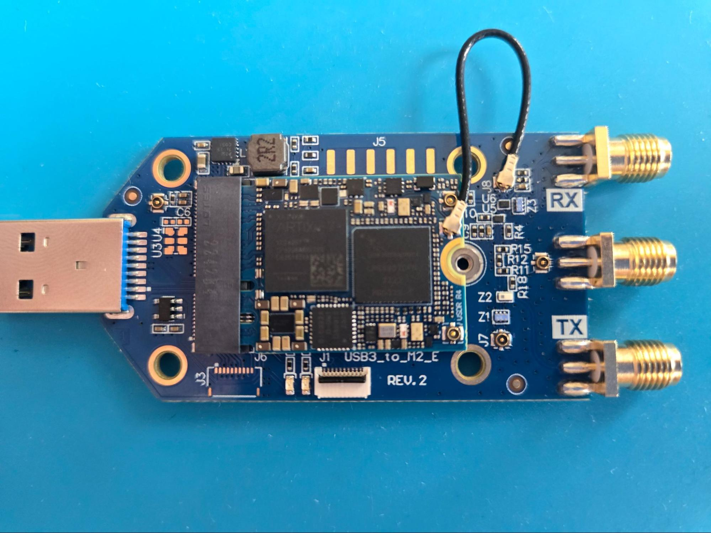
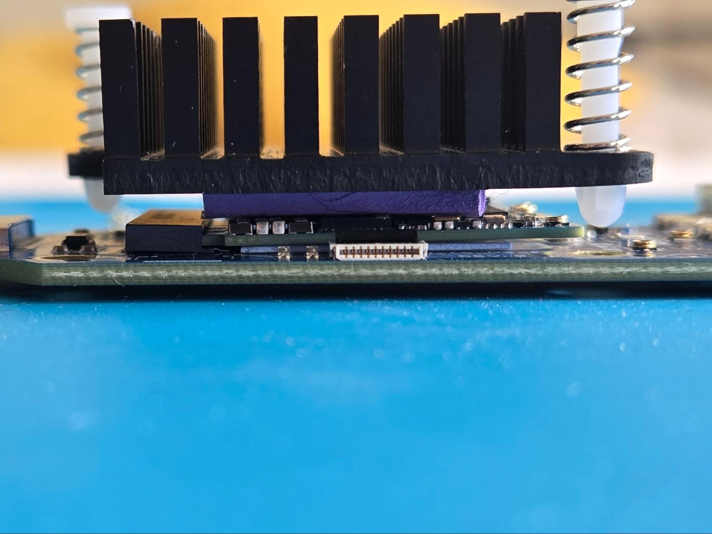

=====================
Heatsink installation
=====================

.. note::

    The same principle applies to all adapters except the M.2 B+M-Key Adapter.

Installation
------------

Assemble items in the order shown in the picture:

* Grab an adapter.
* Peel off the cover shield from the thin thermal interface (0.5mm) and apply it to the top of the adapter where the USDR will be placed.

.. image:: ../_static/hw_heatsink_2.jpg
   :alt: Heatsink installation: thermal interface

* Gently plug the USDR into the adapter.
* Route the MHF4 jumper cables from the USDR onto the adapter (refer to the specific adapter instructions in the main menu).

* Peel off the cover shield from the thick thermal interface (2.0mm) and apply it on top of the USDR.
* Apply the heatsink.

This is how the assembly should look like:

