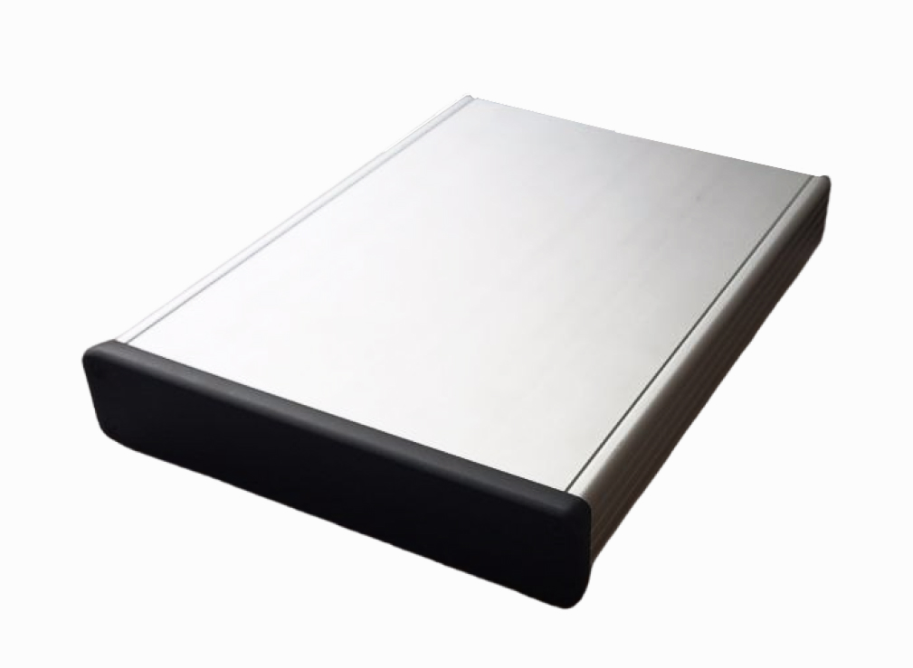

=========
InSpectRF
=========

A **superheterodyne receiver solution** offering **wide dynamic range and linearity** for **spectrum monitoring applications**.

Introduction
============

**InSpectRF** is a high-performance spectrum monitoring receiver, designed with a **superheterodyne architecture** for exceptional **dynamic range and linearity**. 

With an integrated **Raspberry Pi 5 module**, it operates autonomously, sending only **triggered events** when necessary. **InSpectRF** can be configured to run through **Ethernet or WiFi (5 GHz)** and is fully compatible with the **WSDR platform**, allowing for **autonomous data storage**.

General Specifications
======================

**Architecture**  
  - High-speed **16-bit ADC** connected via **PCIe** to **Raspberry Pi 5**  

**Power Consumption**  
  - **<1W Idle**  
  - **9W Typical**  
  - **15W Max**  

**Interface**  
  - **Ethernet** or **WiFi 5 GHz**  

**Extended Power Supply Range**  
  - **8 - 13 V**  

RF Specifications
=================

**Frontend**  
  - **2-stage superheterodyne** with **preselector and filter bank**  

**ADC**  
  - **250 MSps RF Sampling ADC** operating in **3rd Nyquist zone** (312.5 MHz center)  

**Frequency Range**  
  - **20 MHz - 5000 MHz** (up to **6000 MHz** in extended range version)  

**Sample Rate**  
  - **125 MSps Complex**, with decimations:  
    - **2, 3, 4, 5, 6, 8, 9, 10, 12, 16, 18, 20, 24, 32, 48, 64**  

**Channel Bandwidth**  
  - **100 MHz filtered usable bandwidth**  

Target Applications
===================

**Cellular Communication Monitoring**  
  - **Real-time 4G/5G base station spectrum monitoring**  
  - **Up to 100 MHz analog bandwidth**  
  - **Indoor mapping and link quality control**  

**Instrumentation**  
  - **High linearity and dynamic range** ideal for **lab usage**  
  - **RF sampling architecture eliminates RX LO & RX IQ imbalance calibration**  
  - **Superior EVM out of the box**  

**Data Acquisition**  
  - **Built-in Raspberry Pi 5** enables onboard **data analysis and storage**  
  - **Seamless integration with WSDR** for **automated data acquisition systems**  

Legacy Software Support
=======================

- **GNU Radio and many more through SoapySDR**  
