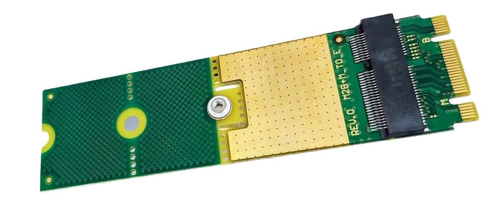

================================
M.2 B+M Key to M.2 E Key Adapter
================================

It’s hard to find this particular adapter, so we made our own.
It’s 22-mm wide and has 80/60/42 screw position to support the M.2 2280, 2260, and 2242 form factors.
It contains no active components, so you can just trim off whatever portion of the adapter you don’t need.

