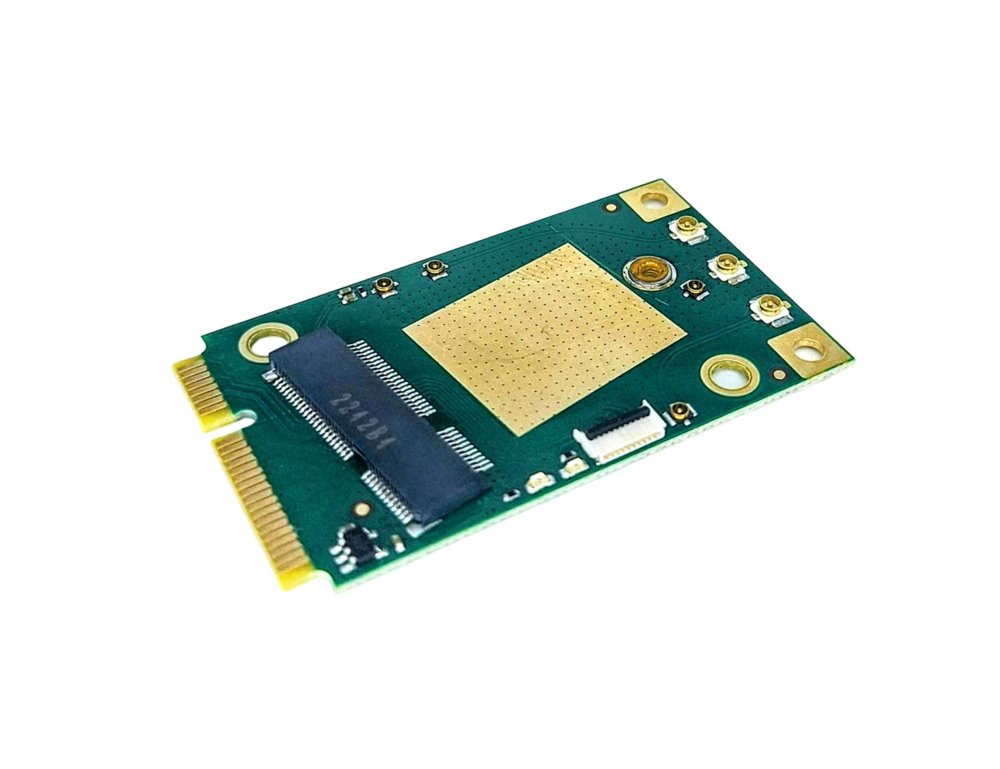

==============================
Mini PCIe to M.2 E Key Adapter
==============================

There are plenty of Mini PCIe adapters out there, but we made this with a few extra features, including:

* The ability to route two PCIe lanes instead of just one
* Six GPIOs exposed to an FPC cable, along with 1.8 V
* A connector for an external reference clock
* Mounting holes for a heatsink

