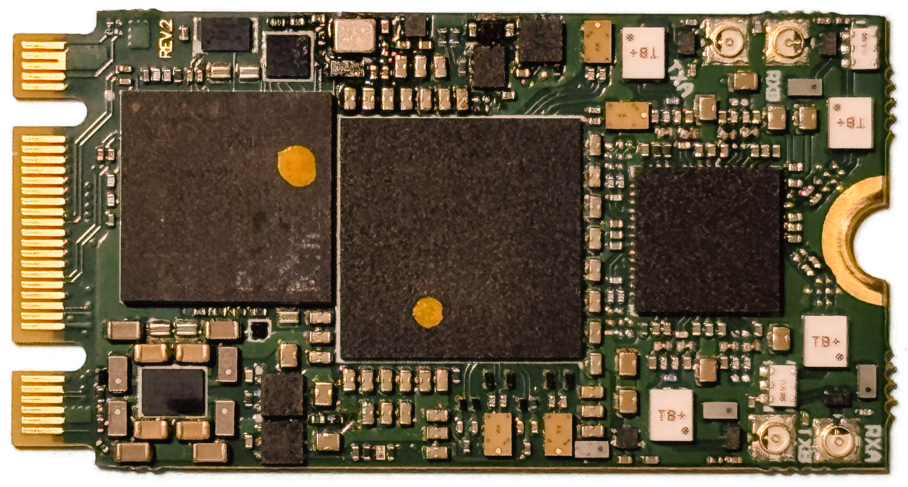

===========
sSDR module
===========

A compact M.2 software-defined radio (SDR) with 2 RX/TX channels, single-sided components, and an extended frequency range.

Introduction
============

The sSDR is a compact M.2 software-defined radio card with an expansive RF range from 30 MHz to 9 GHz,
covering **5G (7.125 GHz)**, the latest **WiFi**, radio links, and many more applications.

Paired with **wsdr.io** and various host devices, it enables the rapid development of custom RF solutions.

General Specifications
======================

**FPGA**  
  - AMD Artix UltraScale+ XCAU7P Ability to offload IQ processing (60-70% resources available)
  - AMD XC7A35T  (Lite version)

**Power Consumption**  
  - 2.9W Typical  
  - 5.5W Max  

**Interface**  
  - M.2 2242 M key (PCIe 3.0 x4 + USB2.0)
  - M.2 2242 B+M key (PCIe 2.0 x2 + USB 2.0) - Lite ver 

**Extended Power Supply Range**  
  - 2.85 - 5.5 V  

**External Clock Synchronization**  
  - Synchronize multiple boards for a multi-channel array  

RF Specifications
=================

**RFIC**  
  - LMS7002M + LMS8001  

**Frontend**  
  - Integrated high-pass and low-pass filters for Hi / Lo RX bands  

**Frequency Range**  
  - 30 MHz to 11 GHz

**Sample Rate**  
  - 4 MSps - 86 MSps

**Channel Bandwidth**  
  - 0.5 MHz - 120 MHz  (MIMO)
  - 122.88MSps (SISO)

Target Applications
===================

**Cellular Communication**
  - Establish dedicated wireless networks by implementing **eNodeB** or **gNodeB** systems via open-source solutions like **srsRAN (4G/5G)** or **Amarisoft**
  - Build dedicated high-frequency radio links

**X-Band**
  - X-band around **10.5 GHz** occupies a “sweet spot” in the RF spectrum where multiple physical and practical advantages align
  - Widely used in **radar**, **remote sensing**, **communications**, **instrumentation**, and **advanced radiolocation** systems due to its high resolution

**Embedded**
  - Develop compact and high-performance **frequency-analysis** devices

**Data Link**
  - Build communication channels between points worldwide through a **web-enabled platform**

Software Support
================

- **GNU Radio**, **srsRAN**, and many more through **SoapySDR**.
