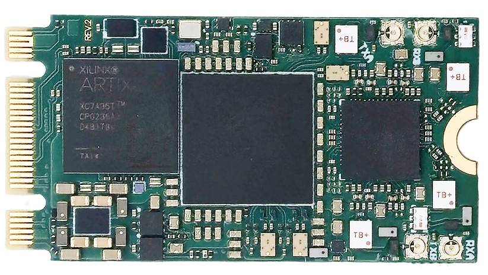
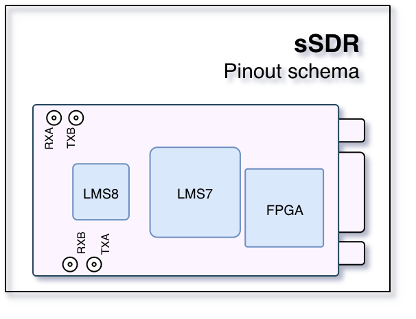
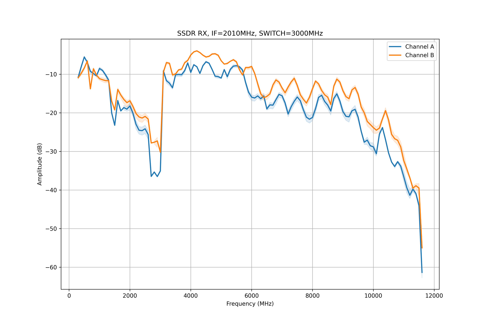
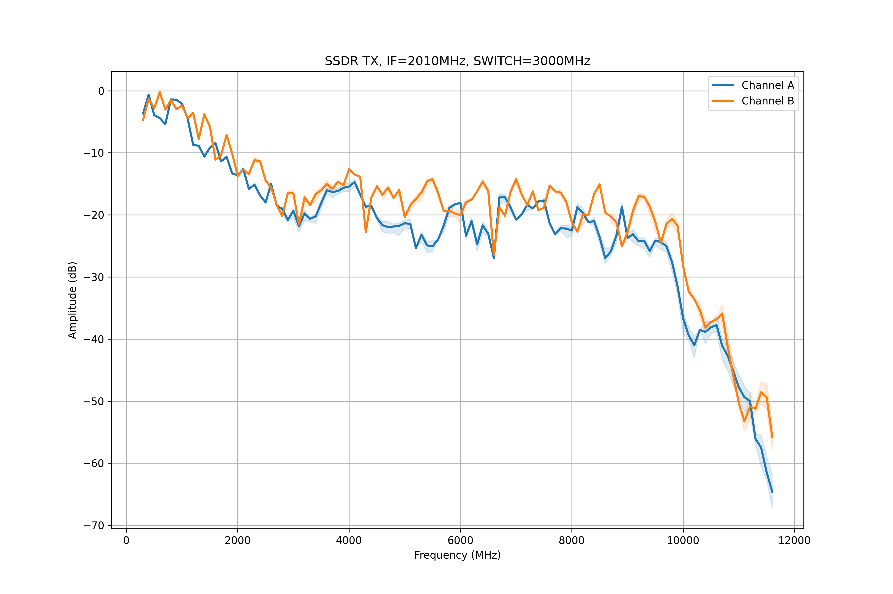

===========
sSDR module
===========

A compact M.2 software-defined radio (SDR) with 2 RX/TX channels, single-sided components, and an extended frequency range.

Introduction
============

The sSDR is a compact M.2 software-defined radio card with an expansive RF range from 30 MHz to 11 GHz,
covering **5G (7.125 GHz)**, the latest **WiFi**, radio links, and many more applications.

Paired with **wsdr.io** and various host devices, it enables the rapid development of custom RF solutions.

General Specifications
======================

**FPGA**  
  - AMD XC7A50T (Rev2)
  - AMD UltraScale+ XCAU7P (Rev3)

**Power Consumption**  
  - 2.9W Typical  
  - 5.5W Max  

**Interface**  
  - M.2 2242 B+M key (PCIe 2.0 x2 + USB 2.0) (Rev2)
  - M.2 2242 M key (PCIe 3.0 x4 + USB 2.0) (Rev3)

M.2 2242 form factor: Width: 22 mm X Length: 42 mm X Thickness: ~3mm

**Extended Power Supply Range**  
  - 2.85 - 5.5 V  

**External Clock Synchronization**  
  - Synchronize multiple boards for a multi-channel array  

RF Specifications
=================

**RFIC**  
  - LMS7002M + LMS8001  

**Frontend**  
  - Integrated high-pass and low-pass filters for Hi / Lo RX bands  

**Frequency Range**  
  - 30 MHz to 11 GHz

**Sample Rate**  
  - 0.1 MSps - 86 MSps (MIMO)
  - 122.88MSps (SISO)

**Channel Bandwidth**  
  - 0.5 MHz - 120 MHz  (MIMO)
  - 122.88MSps (SISO)

**RF cable connectors**  
  - MHF 7S

Pinout
======

Target Applications
===================

**Cellular Communication**
  - Establish dedicated wireless networks by implementing **eNodeB** or **gNodeB** systems via open-source solutions like **srsRAN (4G/5G)** or **Amarisoft**
  - Build dedicated high-frequency radio links

**X-Band**
  - X-band around **10.5 GHz** occupies a “sweet spot” in the RF spectrum where multiple physical and practical advantages align
  - Widely used in **radar**, **remote sensing**, **communications**, **instrumentation**, and **advanced radiolocation** systems due to its high resolution

**Embedded**
  - Develop compact and high-performance **frequency-analysis** devices

**Data Link**
  - Build communication channels between points worldwide through a **web-enabled platform**

Measurements
============

This section contains RF measurements for SSDR board.

   Parameters of RX measured at 2010 MHz IF, with the switchover frequency set to 3000 MHz.

   Parameters of TX measured at 2010 MHz IF, with the switchover frequency set to 3000 MHz.

Getting Started
===============

The **sSDR** requires a newer version of the software than the standard package release.
To ensure proper operation, build **usdr-lib** from source using the
``feature_pe_sync`` branch, install the kernel driver, and verify operation
using **SoapySDR** or the ``usdr_dm_create`` tool.

This guide covers:

* Building the software from source
* Installing the kernel module
* Installing the SoapySDR plugin
* Verifying the device
* Capturing your first RF signal

Software Stack
==============

The sSDR operates using the following software stack::

    SDR Applications
    (CubicSDR / GNU Radio / Gqrx / custom apps)
            │
            ▼
    SoapySDR USDR plugin
    (soapysdr-module-usdr)
            │
            ▼
    usdr-lib
            │
            ▼
    Kernel driver
    (usdr_pcie_uram)
            │
            ▼
    sSDR hardware

1. Clone the Repository
====================

Build the required software from the ``feature_pe_sync`` branch.

.. code-block:: bash

    git clone https://github.com/wavelet-lab/usdr-lib.git
    cd usdr-lib
    git checkout feature_pe_sync

2. Install Dependencies
====================

Ubuntu 20.04 / 22.04 / 24.04, Debian 12, Raspberry Pi OS:

.. code-block:: bash

    sudo apt install -y build-essential cmake python3 python3-venv python3-yaml dwarves
    sudo apt install -y libsoapysdr-dev libusb-1.0-0-dev check dkms

3. Build the Software
==================

Standard build:

.. code-block:: bash

    mkdir build
    cd build
    cmake -DCMAKE_INSTALL_PREFIX:PATH=/usr ../src
    make -j$(nproc)
    sudo make install

Debug build (optional):

.. code-block:: bash

    mkdir build
    cd build
    cmake -DCMAKE_INSTALL_PREFIX:PATH=/usr -DCMAKE_BUILD_TYPE=Debug ../src
    make -j$(nproc)
    sudo make install

4. Enroll the MOK Key
==================

This step is required only on **Secure Boot systems** so the kernel module can
be loaded.

.. code-block:: bash

    sudo apt-get install -y shim-signed mokutil
    sudo update-secureboot-policy --new-key
    sudo update-secureboot-policy --enroll-key

The utility will ask you to create a password.

After that:

1. Reboot the system
2. The BIOS/UEFI interface will prompt you to enroll the key
3. Select **Enroll key**
4. Enter the password you created

This step only needs to be performed once.

5. Build and Install the Kernel Module
===================================

Install kernel headers:

.. code-block:: bash

    sudo apt install -y linux-headers-$(uname -r)

Build the driver:

.. code-block:: bash

    cd ../src/lib/lowlevel/pcie_uram/driver/
    make

Sign the module (Secure Boot systems):

.. code-block:: bash

    sudo kmodsign sha512 \
    /var/lib/shim-signed/mok/MOK.priv \
    /var/lib/shim-signed/mok/MOK.der \
    usdr_pcie_uram.ko

Load the module:

.. code-block:: bash

    sudo insmod usdr_pcie_uram.ko

Install udev rules:

.. code-block:: bash

    sudo cp ./helpers/50-usdr-pcie-driver.rules /etc/udev/rules.d/

6. Install the SoapySDR Plugin
===========================

Install the SoapySDR USDR plugin.

.. code-block:: bash

    sudo apt install -y soapysdr-module-usdr

Verify that the device is detected:

.. code-block:: bash

    SoapySDRUtil --find

If installation is correct, the **USDR / sSDR device** will appear in the list.

7. First RF Capture
================

The ``usdr_dm_create`` tool can be used to verify that the device is working
correctly.

Example: capture RF samples at **1200 MHz**.

.. code-block:: bash

    usdr_dm_create -r4e6 -e1200e6 -c100000 -f test.iq

This command:

* sets the sample rate to **4 MSPS**
* tunes to **1200 MHz**
* captures IQ data
* saves the result to ``test.iq``

8. View the RF Spectrum
====================

Launch **CubicSDR**:

.. code-block:: bash

    CubicSDR

Then:

1. Select the **USDR / sSDR device**
2. Ensure the **sample rate is at least 8 MHz**
3. Press **Start**

You can now tune frequencies and observe the RF spectrum.

9. Troubleshooting
===============

Device not detected
-------------------

Run:

.. code-block:: bash

    SoapySDRUtil --find

If no device appears:

* verify the kernel module is loaded
* check the hardware connection
* reboot after Secure Boot enrollment
* verify udev rules were installed

Module fails to load
--------------------

Ensure kernel headers are installed:

.. code-block:: bash

    sudo apt install linux-headers-$(uname -r)

Spectrum shows only noise
-------------------------

Verify:

* antenna is connected
* correct frequency is selected
* gain settings are appropriate
* sample rate is at least **8 MHz**

10. Quick Start Summary
===================

For experienced users:

.. code-block:: bash

    git clone https://github.com/wavelet-lab/usdr-lib.git
    cd usdr-lib
    git checkout feature_pe_sync
    mkdir build && cd build
    cmake -DCMAKE_INSTALL_PREFIX:PATH=/usr ../src
    make -j$(nproc)
    sudo make install
    sudo apt install -y soapysdr-module-usdr
    SoapySDRUtil --find
    usdr_dm_create -r4e6 -e1200e6 -c100000 -f test.iq
