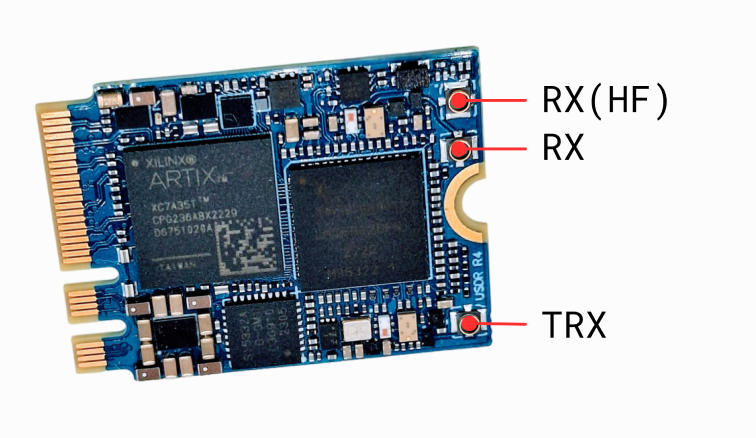

===========
uSDR module
===========

A tiny, single-sided M.2 2230 A+E key form factor Software Defined Radio board.

.. image:: ../_static/hw_usdr_1.jpg
   :alt: uSDR module

Features & Specifications
-------------------------

* M.2 2230 Key A+E interface
* Full-duplex TX & RX
* Frequency range: 300 - 3700 MHz (usable range typically starts from 230 MHz)
* Extra HF range(receive only): 1 - 250 MHz
* RX/TX Bandwidth: 0.75 - 28 MHz plus bypass mode
* Clock stability: 0.5 PPM
* Sample rate up to 30.72 Msps (40+ Msps in bypass mode)
* High-Speed USB 2.0: 480 Mbps, streaming ~15 Msps half-duplex or ~5-6 Msps full-duplex
* Extended power supply range: 2.85 - 5.5 V
* Components on only one side of the PCB
* PCIe support in legacy mode
* MHF4 RF connectors

uSDR Pinout Diagram
-------------------

* RX(HF) - RF Input(for signals below 250 MHz)
* RX - RF Input
* TX - RF Output
