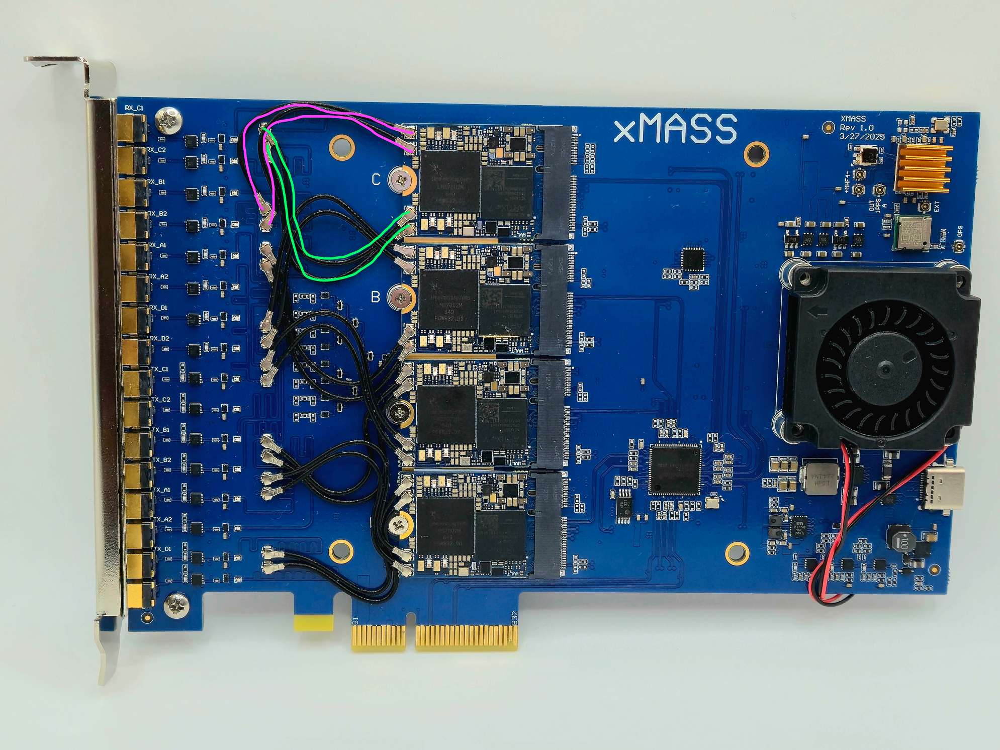
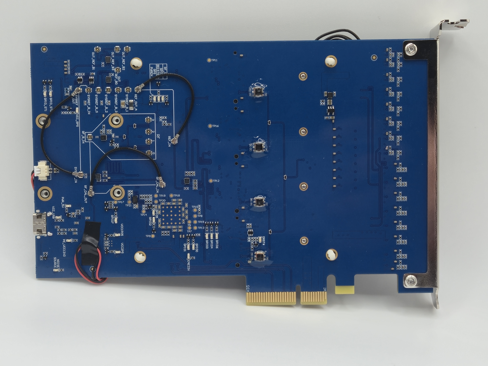
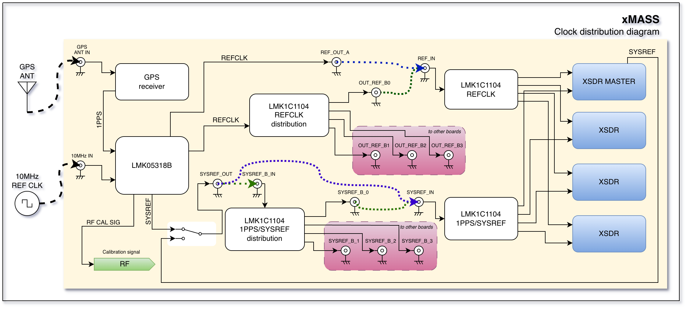
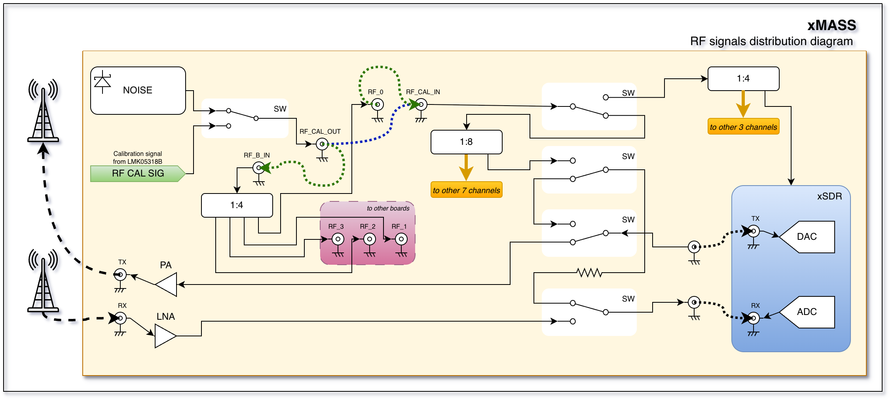

=========
xMASS SDR
=========

A modular, high-performance **8×8 MIMO transceiver** designed for **4G/5G applications** and other use cases.

.. image:: ../_static/xmass_front.jpg
   :alt: xmass sdr

Overview
========

The xMASS SDR is a modular, high-performance **MIMO transceiver** featuring **8 RX and 8 TX channels** which can be synchronized. Its modular design allows for easy maintenance and enables the construction of high-order MIMO systems using the same building blocks.

General Specifications
----------------------

**FPGA**  
  - 4× AMD XC7A35T  

**Clock Synchronization**  
  - LMK05318  

**Module Host Interface**  
  - PCIe 3.0 x2 connection  

**Form Factor**  
  - PCIe x4 (2 PCIe lanes used)  

**Power Consumption**  
  - 1.9W Typical
  - 3W Max

**Extended Power Supply Range**  
  - 2.85 - 5.5 V  

RF Specifications
-----------------

**RFIC**  
  - 4× LMS7002  

**Frequency Range**  
  - 30 MHz to 3.8 GHz  

**Sample Rate**  
  - 0.1 MSps - 100 MSps  

**Channel Bandwidth**  
  - 0.5 MHz - 90 MHz  

Bifurcation Modes
-----------------

- **Full 8×8 MIMO**  
- **2 independent 4×4 MIMO systems**  
- **4 independent 2×2 MIMO systems**  

Target Applications
-------------------

**Spectrum Monitoring**  
  - **4× M.2 2230 Key A+E xSDR** for comprehensive frequency analysis and monitoring  

**Cellular Communication**  
  - Enables next-generation **4G/5G wireless networks** with high-order **massive MIMO**  
  - Fully compatible with **Amarisoft** and **srsRAN**  

**Directional Finding**  
  - Determines the **direction of arrival (DoA)** of incoming radio signals, enabling **precise localization** of transmitters  

**Beamforming**  
  - Focuses signal transmission and reception in specific directions  
  - Enhances range, improves signal quality, and reduces interference in multi-user environments

Connections
===========

Front side
----------

The xMASS SDR has 4 slots for M.2 xSDR modules. Slot A is the master module and is required for the xMASS to control the AF part of the board.

The MHF4 connector of each xSDR module should be connected as shown in the picture above. Please note that the cables should be connected crosswise.

Back side
---------

Back panel
----------

The back panel of the xMASS SDR has 16 external MMCX connectors for RF signals. The top 8 connectors are RX channels, and the bottom 8 connectors are TX channels.

Clocks and synchronization
==========================

There are two clock domains on the xMASS SDR:

* **REFCLK**: Reference clock used for phase synchronization and RF frequency calibration.
* **SYSREF**: Event synchronization: start, stop, and other control signals.

The **LMK05318B** serves as the central clocking IC on the xMASS SDR and can use different clock sources:

* On-board crystal oscillator.
* External reference clock input (10 MHz typical; range: 10 MHz to 40 MHz).
* GPS synchronization using the on-board GPS module.

The IC produces the following output signals:

* Reference clock output to all xSDR modules.
* SYSREF output to all xSDR modules.
* Calibrated reference clock output for the RF calibration loop.

Standalone mode
---------------

Standalone mode is used when only one xMASS SDR is present. In this mode most distribution schemes can be avoided, and synchronization buses should be connected as follows:

* ``REF_OUT_A`` to ``REF_IN``.
* ``SYSREF_OUT`` to ``SYSREF_IN``.

.. note::
   | Bold blue dotted lines in the picture above show the connections for standalone mode.

Multiboard mode
---------------

If you need to use multiple xMASS SDR boards synchronized together, you can use the following connection scheme:

* ``OUT_REF_B0`` to ``REF_IN`` on the same (master) board.
* ``OUT_REF_B1``, ``OUT_REF_B2`` and ``OUT_REF_B3`` to ``REF_IN`` on each additional (slave) board, respectively.
* ``SYSREF_OUT`` to ``SYSREF_B_IN`` on the same (master) board.
* ``SYSREF_B_0`` to ``SYSREF_IN`` on the same (master) board.
* ``SYSREF_B_1``, ``SYSREF_B_2`` and ``SYSREF_B_3`` to ``SYSREF_IN`` on each additional (slave) board, respectively.

.. note::
   | Bold green dotted lines in the picture above show the connections for multiboard mode.

RF distribution
===============

.. note::
   | The diagram above shows the RF distribution for one pair of RX/TX channels.
   | The rest of the channels are connected in the same way.

In standalone mode, the RF distribution should be connected as follows:

* ``RF_CAL_OUT`` to ``RF_CAL_IN``.

In multiboard mode, the RF distribution should be connected as follows:

* ``RF_CAL_OUT`` to ``RF_B_IN`` on the same (master) board.
* ``RF_0`` to ``RF_CAL_IN`` on the same (master) board.
* ``RF_1``, ``RF_2`` and ``RF_3`` to ``RF_CAL_IN`` on each additional (slave) board, respectively.

.. note::
   | Bold blue dotted lines in the picture above show connections for standalone mode.
   | Bold green dotted lines in the picture above show connections for multiboard mode.

Calibration network
-------------------

The board includes a NOISE source that can be used for calibration and testing.
In addition, the **LMK05318B** can provide a calibrated reference signal for the RF calibration loop.

Calibration signals can be routed to each channel using series software-controlled switches.

The possible RF paths are:

* Normal RX/TX path: TX from MMCX to xSDR module and RX from xSDR module to MMCX.
* Calibration path: NOISE or CAL signal to xSDR module for RX calibration.
* Loopback path: TX from xSDR module to RX of the same channel for loopback testing.

In addition, the NOISE/CAL signal can be routed to the first channel of each xSDR module directly through the M.2 socket. This avoids using the RF frontend, resulting in more accurate calibration.

Software
========

.. note::
   | You must install the required software and driver packages first.
   | Please refer to the :doc:`/software/install`.

In order to use xMASS SDR, you can use the **usdr_dm_create** utility to receive or transmit data.

The following example creates a raw IQ data file with a sample rate of 10 MSamples per second per channel, a center frequency of 1700 MHz, using all 8 RX channels:

.. code-block:: bash

   usdr_dm_create -D bus=pci/dev/usdr0:/dev/usdr1:/dev/usdr2:/dev/usdr3 -r10e6 -l3 -e1700e6 -c -1 -f output.raw

The software stack supports the **SoapySDR** interface, so you can use any compatible application.
