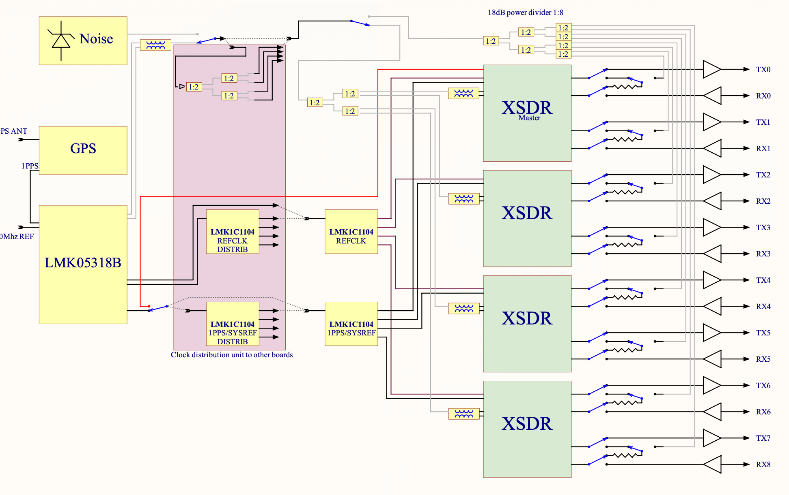

=========
xMASS SDR
=========

A modular, high-performance **8×8 MIMO transceiver** designed for **4G/5G applications** and more.

.. image:: ../_static/xmass_front.jpg
   :alt: xmass sdr

Overview
========

The xMASS SDR is a modular, high-performance **MIMO transceiver** featuring **8 RX and 8 TX channels** that can be synchronized. Its modular design allows for easy maintenance and enables the construction of high-order MIMO systems using the same building blocks.

General Specifications
----------------------

**FPGA**  
  - 4× AMD XC7A35T  

**Clock Synchronization**  
  - LMK05318  

**Module Host Interface**  
  - PCIe 3.0 x2 connection  

**Form Factor**  
  - PCIe x4 (2 PCIe lanes used)  

**Power Consumption**  
  - 1.9W Typical  
  - 3W Max  

**Extended Power Supply Range**  
  - 2.85 - 5.5 V  

RF Specifications
-----------------

**RFIC**  
  - 4× LMS7002  

**Frequency Range**  
  - 30 MHz to 3.8 GHz  

**Sample Rate**  
  - 0.1 MSps - 100 MSps  

**Channel Bandwidth**  
  - 0.5 MHz - 90 MHz  

Bifurcation Modes
-----------------

- **Full 8×8 MIMO**  
- **2 independent 4×4 MIMO systems**  
- **4 independent 2×2 MIMO systems**  

Target Applications
-------------------

**Spectrum Monitoring**  
  - **4× M.2 2230 Key A+E xSDR** for comprehensive frequency analysis and monitoring  

**Cellular Communication**  
  - Enables next-generation **4G/5G wireless networks** with high-order **massive MIMO**  
  - Fully compatible with **Amarisoft** and **srsRAN**  

**Directional Finding**  
  - Determines the **direction of arrival (DoA)** of incoming radio signals, enabling **precise localization** of transmitters  

**Beamforming**  
  - Focuses signal transmission and reception in specific directions  
  - Enhances range, improves signal quality, and reduces interference in multi-user environments  

Software Support
----------------

- **GNU Radio, srsRAN, and many more through SoapySDR**  

Connections
===========

Front side
----------

The xMASS SDR have 4 slots for M.2 xSDR modules.
The slot A is the master module and this one is required for the xMASS to control AF part of the board.

.. image:: ../_static/xmass_front_connect.png
   :alt: xmass sdr

MHF4 of the each xSDR module should be connected as showed on the picture above.
Please note that the cables should be connected crosswise.

Back side
---------

.. image:: ../_static/xmass_back.jpg
   :alt: xmass sdr

The standard connections on the back panel are:

* ``REF_OUT_A`` to ``REF_IN``
* ``RF_CAL_OUT`` to ``RF_CAL_IN``
* ``SYSREF_OUT`` to ``SYSREF_IN``

Back panel
----------

Back panel of the xMASS SDR has 16 external MMCX connectors for RF signals.
Top 8 connectors are RX channels and the bottom 8 connectors are TX channels.

RF path diagram
---------------

Software
========

.. note::
   | You have to install software and driver packages first.
   | Please refer to the :doc:`/software/install`.

In order to use xMASS SDR, you can use the **usdr_dm_create** utility to receive or transmit data.

The following example creates a raw IQ data file with 10 MSamples per second sample rate per channel,
center frequency at 1700 MHz, using all 8 RX channels:

.. code-block:: bash

   usdr_dm_create -D bus=pci/dev/usdr0:/dev/usdr1:/dev/usdr2:/dev/usdr3 -r10e6 -l3 -e1700e6 -c -1 -f output.raw

The software stack supports SoapySDR interface, so you can use any compatible application.

