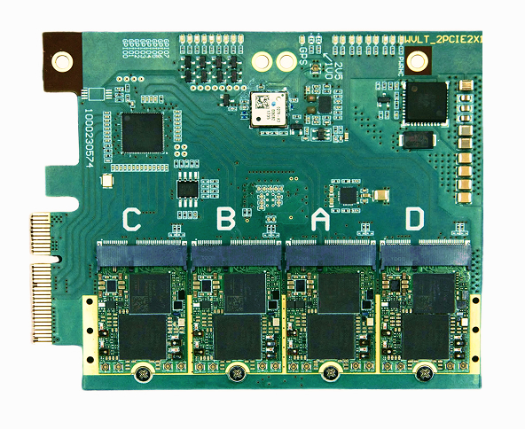

=========
xMASS SDR
=========

A modular, high-performance **8×8 MIMO transceiver** designed for **4G/5G applications** and more.

Introduction
============

The xMASS SDR is a modular, high-performance **MIMO transceiver** featuring **8 RX and 8 TX channels** that can be synchronized. Its modular design allows for easy maintenance and enables the construction of high-order MIMO systems using the same building blocks.

General Specifications
======================

**FPGA**  
  - 4× AMD XC7A35T  

**Clock Synchronization**  
  - LMK05318  

**Module Host Interface**  
  - PCIe 3.0 x2 connection  

**Form Factor**  
  - PCIe x4 (2 PCIe lanes used)  

**Power Consumption**  
  - 1.9W Typical  
  - 3W Max  

**Extended Power Supply Range**  
  - 2.85 - 5.5 V  

RF Specifications
=================

**RFIC**  
  - 4× LMS7002  

**Frequency Range**  
  - 30 MHz to 3.8 GHz  

**Sample Rate**  
  - 0.1 MSps - 100 MSps  

**Channel Bandwidth**  
  - 0.5 MHz - 90 MHz  

Bifurcation Modes
=================

- **Full 8×8 MIMO**  
- **2 independent 4×4 MIMO systems**  
- **4 independent 2×2 MIMO systems**  

Target Applications
===================

**Spectrum Monitoring**  
  - **4× M.2 2230 Key A+E xSDR** for comprehensive frequency analysis and monitoring  

**Cellular Communication**  
  - Enables next-generation **4G/5G wireless networks** with high-order **massive MIMO**  
  - Fully compatible with **Amarisoft** and **srsRAN**  

**Directional Finding**  
  - Determines the **direction of arrival (DoA)** of incoming radio signals, enabling **precise localization** of transmitters  

**Beamforming**  
  - Focuses signal transmission and reception in specific directions  
  - Enhances range, improves signal quality, and reduces interference in multi-user environments  

Legacy Software Support
=======================

- **GNU Radio, srsRAN, and many more through SoapySDR**  

Contact
=======

- **Website:** [wavelet-lab.com](https://wavelet-lab.com)  
- **Email:** [contact@wavelet-lab.com](mailto:contact@wavelet-lab.com)  
