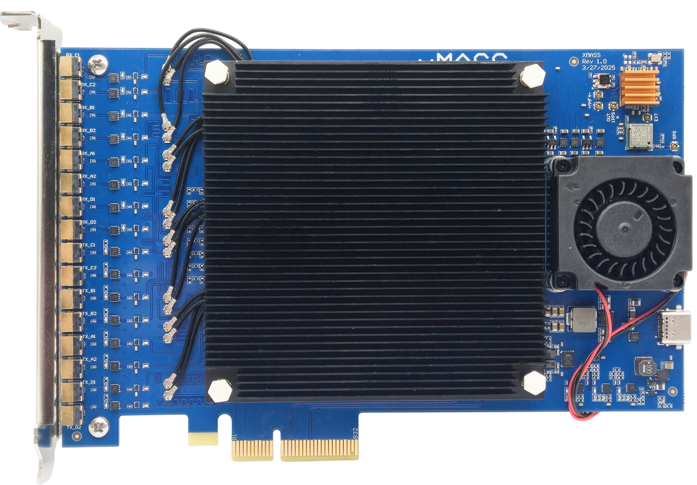
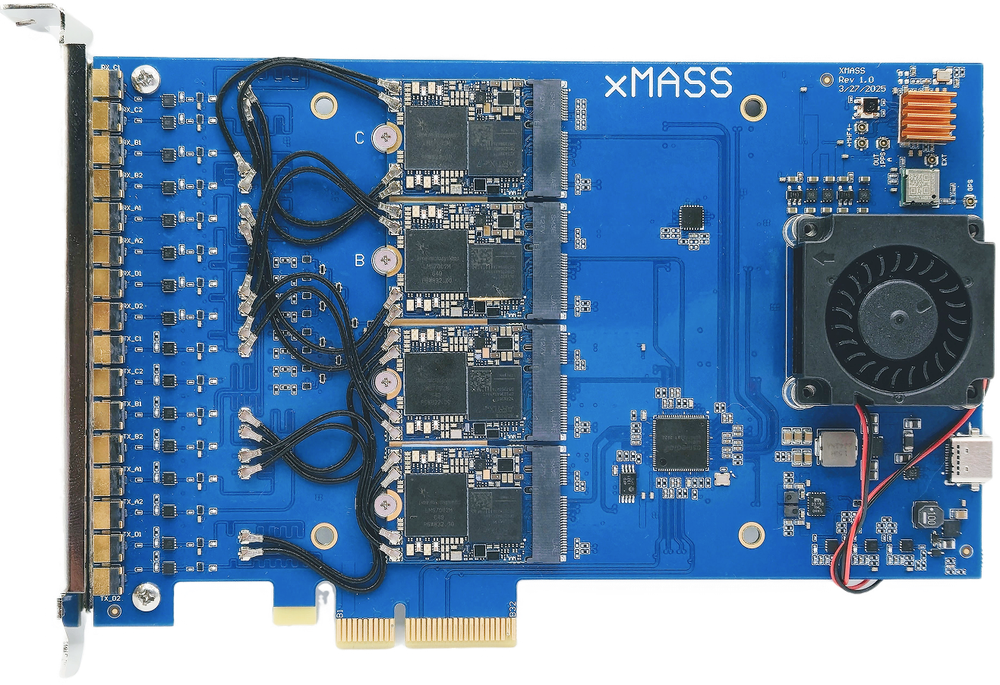
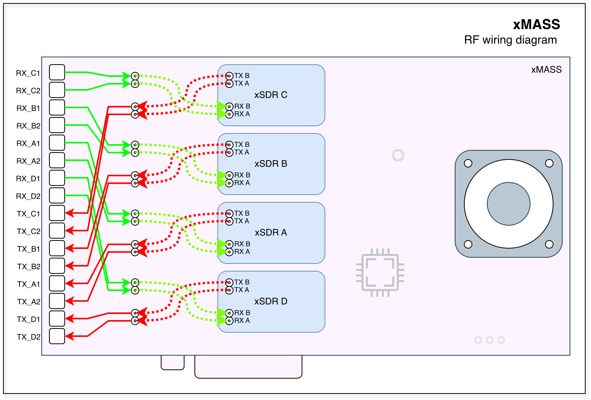
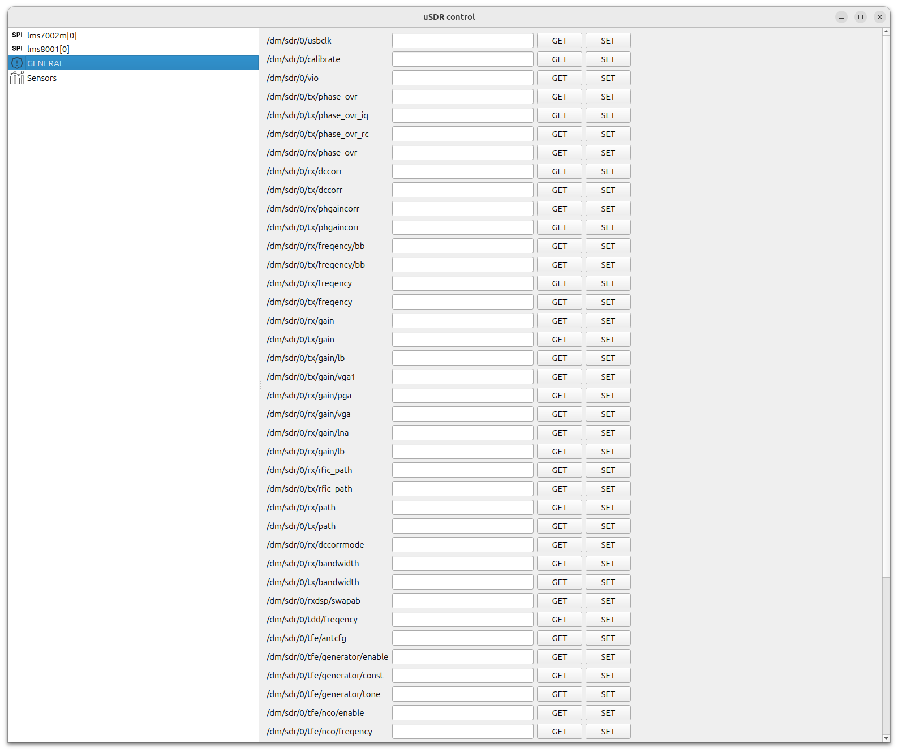
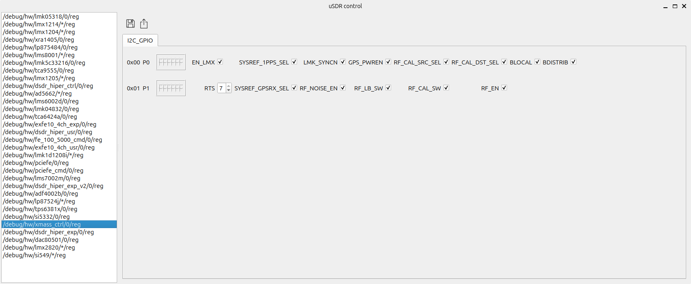

=========
xMASS SDR
=========

A modular, high-performance **8×8 MIMO transceiver** designed for **4G/5G applications** and other use cases.

Overview
========

The xMASS SDR is a modular, high-performance **MIMO transceiver** featuring **8 RX and 8 TX channels** which can be synchronized. Its modular design allows for easy maintenance and enables the construction of high-order MIMO systems using the same building blocks.

.. image:: ../_static/xmass-iso-open-lg.png
   :alt: xmass sdr

General Specifications
----------------------

**FPGA**  
  - 4× AMD XC7A35T  

**Clock Synchronization**  
  - LMK05318  

**Module Host Interface**  
  - PCIe 3.0 x2 connection  

**Form Factor**  
  - PCIe x4 (2 PCIe lanes used)  

**Power Consumption**  
  - 20W Typical

**Extended Power Supply Range**  
  - 2.85 - 5.5 V  

RF Specifications
-----------------

**RFIC**  
  - 4× LMS7002  

**Frequency Range**  
  - 30 MHz to 3.8 GHz  

**Sample Rate**  
  - 0.1 MSps - 100 MSps  

**Channel Bandwidth**  
  - 0.5 MHz - 90 MHz  

Bifurcation Modes
-----------------

The xMASS supports configurable bifurcation modes that partition the physical 8 RX / 8 TX channel array into one or more independent logical streams.
Bifurcation determines how RF channels, FPGA resources, and host I/O are grouped and advertised to the host.
Selecting a bifurcation mode affects aggregate throughput, per-device sample-rate limits, synchronization behaviour, calibration routing, and the available MIMO processing scope.

Available bifurcation modes are:

- **Full 8×8 MIMO**

  - All 8 RX and 8 TX channels are presented as a single logical device with full cross-channel synchronization and shared calibration paths. This mode enables true 8×8 spatial processing (beamforming, full-array DoA, high-order MIMO benchmarks).
  - When to use: research/measurement requiring maximum antenna aperture, advanced beamforming or direction-finding, or when coherent processing across all channels is required.

- **2 independent 4×4 MIMO systems**

  - Description: The 8×8 array is split into two independent 4×4 logical devices. Each group has its own stream context and can be controlled separately while still retaining 4×4 MIMO capability within the group.
  - When to use: deploying two separate 4×4 systems (for example, two co-located base stations or one monitoring system plus one comms system), or when slightly reduced MIMO order still meets spatial processing requirements but host/throughput constraints dictate partitioning.

- **4 independent 2×2 MIMO systems**

  - Description: The array is split into four independent 2×2 logical devices, each suitable for small-scale MIMO links or parallel monitoring tasks.
  - When to use: scenarios requiring multiple independent narrow-band links or many small testbeds.

Target Applications
-------------------

**Spectrum Monitoring**  
  - **4× M.2 2230 Key A+E xSDR** for comprehensive frequency analysis and monitoring  

**Cellular Communication**  
  - Enables next-generation **4G/5G wireless networks** with high-order **massive MIMO**  
  - Fully compatible with **Amarisoft** and **srsRAN**  

**Directional Finding**  
  - Determines the **direction of arrival (DoA)** of incoming radio signals, enabling **precise localization** of transmitters  

**Beamforming**  
  - Focuses signal transmission and reception in specific directions  
  - Enhances range, improves signal quality, and reduces interference in multi-user environments

Connections
===========

Front side
----------

.. note::
   | USB-C is connected to the xSDR A and is intended solely for use in manufacturing test facilities.
   | It is not used during normal operation.

The xMASS SDR has 4 slots for M.2 xSDR modules. Slot A is the master module and is required for the xMASS to control the AF part of the board.

The MHF4 connector of each xSDR module should be connected as shown in the picture above. Please note that the cables should be connected crosswise.

Back side
---------

The back side of the xMASS SDR contains the clocking and synchronization circuitry, RF distribution network and calibration sources.
The picture below shows the standard standalone configuration with one xMASS SDR board.

.. image:: ../_static/xmass_back_zoom_light.jpg
   :alt: xmass sdr

PCI bracket panel
-----------------

The bracket panel of the xMASS SDR has 16 external MMCX connectors for RF signals. The top 8 connectors are RX channels, and the bottom 8 connectors are TX channels.

Clocks and synchronization
==========================

.. image:: ../_static/xmass/xmass_sync.png
   :alt: xmass sdr clocks and synchronization block diagram

There are two clock domains on the xMASS SDR:

* **REFCLK**: Reference clock used for phase synchronization and RF frequency calibration.
* **SYSREF**: Event synchronization: start, stop, and other control signals.

The **LMK05318B** serves as the central clocking IC on the xMASS SDR and can use different clock sources:

* On-board crystal oscillator.
* External reference clock input (10 MHz typical; range: 10 MHz to 40 MHz).
* GPS synchronization using the on-board GPS module.

The IC produces the following output signals:

* Reference clock output to all xSDR modules.
* SYSREF output to all xSDR modules.
* Calibrated reference clock output for the RF calibration loop.

Standalone mode
---------------

Standalone mode is used when only one xMASS SDR is present. In this mode most distribution schemes can be avoided, and synchronization buses should be connected as follows:

* ``REF_OUT_A`` to ``REF_IN``.
* ``SYSREF_OUT`` to ``SYSREF_IN``.

.. note::
   | Bold blue dotted lines in the picture above show the connections for standalone mode.

Multiboard mode
---------------

If you need to use multiple xMASS SDR boards synchronized together, you can use the following connection scheme:

* ``OUT_REF_B0`` to ``REF_IN`` on the same (master) board.
* ``OUT_REF_B1``, ``OUT_REF_B2`` and ``OUT_REF_B3`` to ``REF_IN`` on each additional (slave) board, respectively.
* ``SYSREF_OUT`` to ``SYSREF_B_IN`` on the same (master) board.
* ``SYSREF_B_0`` to ``SYSREF_IN`` on the same (master) board.
* ``SYSREF_B_1``, ``SYSREF_B_2`` and ``SYSREF_B_3`` to ``SYSREF_IN`` on each additional (slave) board, respectively.

.. note::
   | Bold green dotted lines in the picture above show the connections for multiboard mode.

RF distribution
===============

.. image:: ../_static/xmass/xmass_rf.png
   :alt: xmass sdr rf distribution block diagram

.. note::
   | The diagram above shows the RF distribution for one pair of RX/TX channels.
   | The rest of the channels are connected in the same way.

Standalone mode
---------------

The standalone mode provides a closed-loop calibration path and a local RF calibration reference when a single xMASS board is used.

Signal flow
  - ``RF_CAL_OUT`` -> ``RF_CAL_IN`` (local calibration loop through the frontend on the same board).
  - Calibration source (``NOISE`` or ``CAL``) is switched into LNA/TX paths under software control when required.

Multiboard mode
---------------

THe multiboard mode provides calibration and routing scheme for multiple synchronized xMASS boards so that calibration signals and RF paths are common across the array, enabling coherent multi-board MIMO and consistent calibration measurements.

**Signal flow (master / slave)**

  - Master board:

    - ``RF_CAL_OUT`` -> ``RF_B_IN`` (feeds the distributed calibration bus that other boards listen to).
    - ``RF_0`` -> ``RF_CAL_IN`` (local calibration loop using the master board's RF path).

  - Slave boards:

    - ``RF_1``, ``RF_2``, ``RF_3`` -> ``RF_CAL_IN`` on each additional (slave) board, respectively (receive the calibration reference from the master).

.. note::
   | Bold blue dotted lines in the picture above show connections for standalone mode.
   | Bold green dotted lines in the picture above show connections for multiboard mode.

Calibration network
-------------------

The board includes a NOISE source that can be used for calibration and testing.
In addition, the **LMK05318B** can provide a calibrated reference signal for the RF calibration loop.

Calibration signals can be routed to each channel using series software-controlled switches.

The possible RF paths are:

* Normal RX/TX path: TX from MMCX to xSDR module and RX from xSDR module to MMCX.
* Calibration path: NOISE or CAL signal to xSDR module for RX calibration.
* Loopback path: TX from xSDR module to RX of the same channel for loopback testing.

In addition, the ``NOISE``/``CAL`` signal can be routed to the first channel(LNAL_A) of each xSDR module directly through the M.2 socket.
This avoids using the RF frontend, resulting in more accurate calibration.

Frontend control
================

.. note::
   | In order to control the frontend from software, you need to use the ``usdr_registers`` tool.
   | Please refer to the :doc:`/software/usdr_registers`.

GENERAL
-------

This section describes the general control of the board.

.. list-table::
   :header-rows: 1

   * - Register
     - Type
     - Description
   * - /dm/sdr/refclk/path
     -  - internal - Internal clock source/Single board operation
        - external - External clock source/Multi board operation
     - Reference clock source selection
   * - /dm/sdr/refclk/frequency
     - int
     - Reference clock frequency in Hz
   * - /dm/sdr/0/sync/cal/path
     -  - 0 - Normal operation
        - 1 - LO
        - 2 - NOISE
        - 3 - LO_LNA3
        - 4 - NOISE_LNA3
     - Calibration path selection
   * - /dm/sdr/0/sync/cal/freq
     - int
     - LO calibration frequency in Hz

SYSREF
------

In order to enable sysref mode, you have to pass one of the following values to the ``usdr_dms_sync`` api call.

- ``all`` - enable all supported sync sources (sysref, stream-based, external PPS, etc.).
- ``1pps`` or ``sysref`` - explicit sysref via an external 1PPS pulse (external PPS/sysref).
- ``sysref+gen`` - explicit sysref via internal source (using onboard LMK05318B).
- ``rx`` - use the RX stream as the synchronization source.
- ``tx`` - use the TX stream as the synchronization source.
- ``any`` - accept any available sync source (choose the best/first available).
- ``none`` - disable synchronization (no automatic sync).
- ``off`` - turn sync off / explicitly stop syncing (used in code before starting streams).

xmass_ctrl
----------

This section describes the low level control of the board.

.. list-table::
   :header-rows: 1

   * - Register
     - Field
     - Description
   * - P0
     - BDISTRIB
     - Enable OUT_REF_B and OUT_SYSREF_B for 4 sync boards
   * - P0
     - BLOCAL
     - Enable local PPS and REF distribution
   * - P0
     - RF_CAL_DST_SEL
     - 0 - RF_CAL_EXT (general RX port) / 1 - RF_CAL_INT (LNA3 port)
   * - P0
     - RF_CAL_SRC_SEL
     - 0 - RF_LO_SRC (from LMK) / 1 - RF_NOISE_SRC (from NOISE GEN)
   * - P0
     - GPS_PWREN
     - Enable GPS module and DC-bias
   * - P0
     - LMK_SYNCN
     - Set LMK05318B SYNC_N port
   * - P0
     - SYSREF_1PPS_SEL
     - 0 - LMK_1PPS / 1 - From SDR_A
   * - P0
     - EN_LMX
     - Enable LMK05318B
   * - P1
     - RF_EN
     - Enables Power Amplifiers
   * - P1
     - RF_CAL_SW
     - 0 - Use RF cal source as FB / 1 - Use XSDR TX as FB
   * - P1
     - RF_LB_SW
     - 0 - Normal operation / 1 - use loopback path to XSDR RX
   * - P1
     - RF_NOISE_EN
     - Enable 14V generator for Zener noise source
   * - P1
     - SYSREF_GPSRX_SEL
     - 0 - TX_SYREF_MUX demultiplexing to CLK_SYSREF_OUT / 1 - TX_SYREF_MUX to GPS_RX
   * - P1
     - RTS
     - Interboard sync logic(Not used)

Software
========

.. note::
   | You must install the required software and driver packages first.
   | Please refer to the :doc:`/software/install`.

.. note::
   | Please refer to :doc:`/software/usdr_dm_create` for detailed information about using the **usdr_dm_create** utility.

In order to use xMASS SDR, you can use the **usdr_dm_create** utility to receive or transmit data.
B
The following example creates a raw IQ data file with a sample rate of 10 MSamples per second per channel, a center frequency of 1700 MHz, using all 8 RX channels:

.. code-block:: bash

   usdr_dm_create -D bus=pci/dev/usdr0:/dev/usdr1:/dev/usdr2:/dev/usdr3 -r10e6 -l3 -e1700e6 -c -f output.raw

If you want to enable synchronization using SYSREF, you can add the ``-s sysref`` option to the command line:

.. code-block:: bash

   usdr_dm_create -D bus=pci/dev/usdr0:/dev/usdr1:/dev/usdr2:/dev/usdr3 -s sysref -r10e6 -l3 -e1700e6 -c -f output.raw

The first device in the list(usdr0 in this example) should be the master xMASS SDR board(slot A).

The software stack supports the **SoapySDR** interface, so you can use any compatible application.
