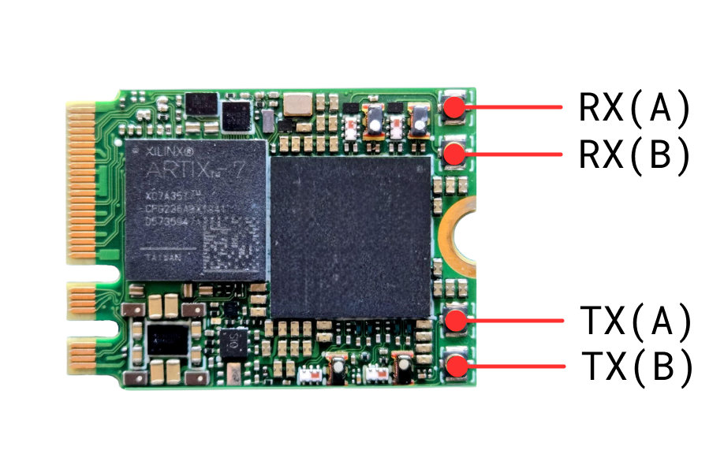

===========
xSDR module
===========

A tiny 2RX/2TX, single-sided M.2 2230 A+E key form factor Software Defined Radio board.

Introduction
============

The XSDR is an **M.2 embedded software-defined radio (SDR) card** designed for seamless integration into systems that support **M.2 or Mini PCIe** (with an adapter). It features an **RF tuning range of 30 MHz to 3.8 GHz**.

By leveraging applications from the **web platform wsdr.io** and various host devices (**laptops, tablets, smartphones, embedded computers, etc.**), users can **immediately build an RF device** tailored to their needs and share or stream data worldwide.

General Specifications
======================

**FPGA**  
  - AMD XC7A35T  

**Power Consumption**  
  - 1.9W Typical  
  - 3W Max  

**Interface**  
  - M.2 2230 A+E key (USB 2.0 & PCIe 2.0 x2)  

**Extended Power Supply Range**  
  - 2.85 - 5.5 V  

**External Clock Synchronization**  
  - Synchronize multiple boards for a **multi-channel array**  

RF Specifications
=================

**RFIC**  
  - LMS7002M  

**Frequency Range**  
  - 30 MHz to 3.8 GHz  

**Sample Rate**  
  - 0.1 MSps - 100 MSps  

**Channel Bandwidth**  
  - 0.5 MHz - 90 MHz  

Target Applications
===================

**Cellular Communication**  
  - Establish dedicated wireless networks by implementing **BTS, eNodeB, or gNodeB** systems via open-source solutions like **srsRAN** or **Amarisoft**  

**Embedded Applications**  
  - Develop **compact and high-performance** frequency analysis devices  

**Data Link**  
  - Build a **communication channel** between points worldwide via a **web platform**  

Legacy Software Support
=======================

- **GNU Radio, srsRAN, and many more through SoapySDR**  
