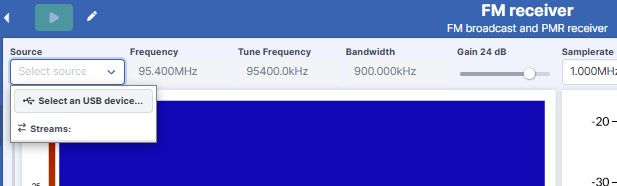

Applications
==================

The WebSDR platform provides a collection of ready-to-use applications for signal processing and SDR tasks. You can launch, configure, and manage applications seamlessly within the **Applications** and **Projects** tabs.

1. Opening an Application
--------------------------

- Click **Applications** to view the list of available SDR apps.
- Click the **+** button to open an app.
- If you do not assign a name, it will be saved as a general app name in your projects.

2. Managing Applications
-------------------------

Opened applications are stored in the **Projects** tab.

In the **Projects** tab, you can:

- **Rename** applications.
- **Delete** unwanted apps.
- **Duplicate** apps for further modifications.

3. Selecting an Input Source
----------------------------

Each application includes a **Source** selection option, allowing you to choose:

✅ **USB device (uSDR)**  
✅ **File-based input**  
✅ **Live stream**  
✅ **Cloud storage**

4. Adjusting Parameters
------------------------

All applications start with pre-configured default parameters.

- You can tweak parameters to match your specifications before running the app.

5. Running an Application
--------------------------

- Click **Run** to start processing the signal.

