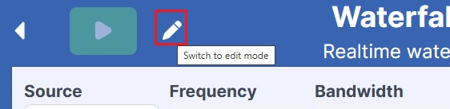

Editing Applications: Edit Mode & Play Mode
===========================================

- **Edit Mode:** Used for configuring function blocks and customizing the application.
- **Play Mode:** Runs the application with the configured settings.

*Click here to switch between Edit and Play Mode.*

1. Understanding Edit Mode
---------------------------

Edit Mode provides a **Data Interaction Map**, a visual representation of the app’s logic, eliminating the need for coding. It allows:

✅ Customizing blocks and modifying their parameters.  
✅ Defining connections between processing elements.

.. image:: ../_static/wsdr/map.jpg
   :alt: Map

2. Types of Blocks (Right Sidebar)
----------------------------------

Blocks are categorized by their function:

- **Source:** Defines the input signal (USB, File, Stream).
- **General:** Processing and transformation blocks.
- **Sink:** Data visualizers for real-time signal analysis.
- **UI:** Interface components for user interaction.
- **Custom Blocks:** Create your own processing blocks from scratch.

3. Adjusting Layout & Parameters
--------------------------------

- **Parameters Tab:** Set the default parameters for each block.

- **Layout Tab:** Customize the UI grid layout by:

  - Repositioning elements freely.

  - Stretching, resizing, and moving components via drag-and-drop.

*For detailed guidance, click* :doc:`intro/how_to_create_app`

See the :ref:`how-to-create-app` section for full instructions.

See the :doc:`step-by-step guide to building apps <intro/how_to_create_app>`.
