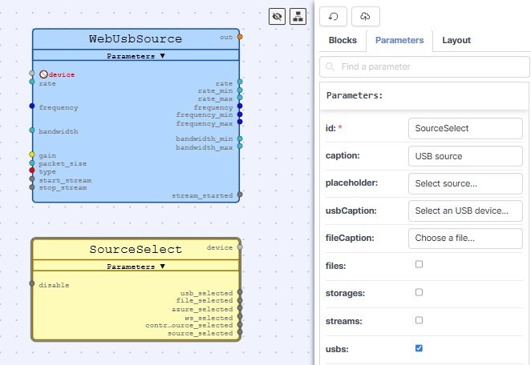
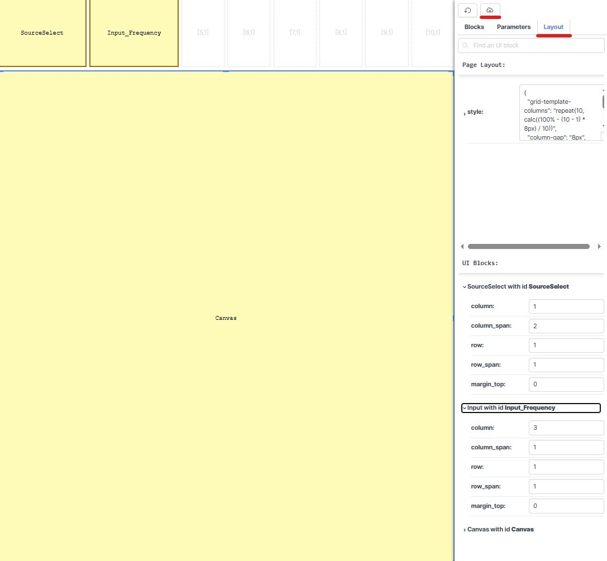

How to Create an App
=====================

The WebSDR platform allows users to:

✅ Use ready-to-use applications  

✅ Modify existing applications  

✅ Create new applications from scratch using function blocks  

In this section, we’ll walk through creating a **Spectrum Waterfall** application, demonstrating the platform’s core principles.

Core Principle
--------------

🔹 Every General or Sink block requires a UI block to display its output on the grid.

Step 1: Create a New Project
----------------------------

- Click **Create Project** and enter a name.
- Switch to **Edit Mode** (for block configuration).

.. image:: ../_static/wsdr/edit_mode.jpg
   :alt: edit mode

**Understanding the Grid System**

- The **Grid block** is the main canvas of your application.
- By default, it consists of **10 columns × 10 rows** (modifiable in the Layout tab).
- Click **Save** to apply any changes.

.. image:: ../_static/wsdr/save.jpg

Step 2: Add a Signal Source
---------------------------

- Drag the **Web USB Source** block from the General category.
- Set its parameters or leave them as default.

**Add a UI "Source Select" block:**

- Assign a caption.
- Enable **USB (usbs)** to activate the USB device.

**Open the Layout Tab:**

- Set the location of the **Source Select** dialog box.
- Click **Save** and switch to **Play Mode** to verify the interface.

.. note::
   Parameters can be set as fixed values or controlled dynamically using functions.

Step 3: Establish Connections
------------------------------

To ensure the SDR device is recognized:

- Connect **Device (WebUSBSource)** → **Device (SourceSelect)**.

**Set up SDR Start/Stop Control:**

- Connect **Started (Grid)** → **Disable (Source Select)**.
- Connect **Source Selected (Source Select)** → **Enable Control (Grid)**.

Step 4: Add Input Controls
--------------------------

To allow frequency control via UI:

- Drag an **Input** block and select **Frequency** as the format.
- Define **Value / Min / Max / Step** (Hz, MHz, GHz).

**Connect:**

- **Value (Input_Frequency)** → **Frequency (WebUSBSource)**.
- **Min/Max** parameters → **WebUSBSource**.
- **Control_Source_Select (SourceSelect)** → **Disable (Input_Frequency)**.

- Open the **Layout Tab**, drag it to position, and click **Save**.

🔹 Repeat these steps for any additional input controls.

Step 5: Add Signal Visualization (Waterfall Display)
----------------------------------------------------

To visualize SDR output:

- Add a **WaterfallSink** block.

**Connect:**

- **Out (WebUSBSource)** → **In (WaterfallSink)**.
- **Rate (WebUSBSource)** → **Rate (WaterfallSink)**.

**Add a UI "Canvas" block:**

- Link **Canvas (WaterfallSink)** → **Canvas (UI Canvas Block)**.

**Layout Tab:**

- Position **WaterfallSink** below the control menu.
- Resize it for display.
- Click **Save**.

Step 6: Test the Application
----------------------------

- Switch to **Play Mode**.
- Select the Source.
- Click **Play**.

- Use **mouse scroll** to change the frequency dynamically.

.. tip::
   Want to learn more?

   - Check the ready-to-use apps in **Edit Mode**.
   - See which blocks were used.
   - Copy parts into your own app.

🎥 `Watch the full Custom Application YouTube playlist <https://youtube.com/playlist?list=PLAJOd9pfRFHMexBS8ZfiCh3C9xRGbmqnA&si=HUZWnHCw-VphFOaX>`__
