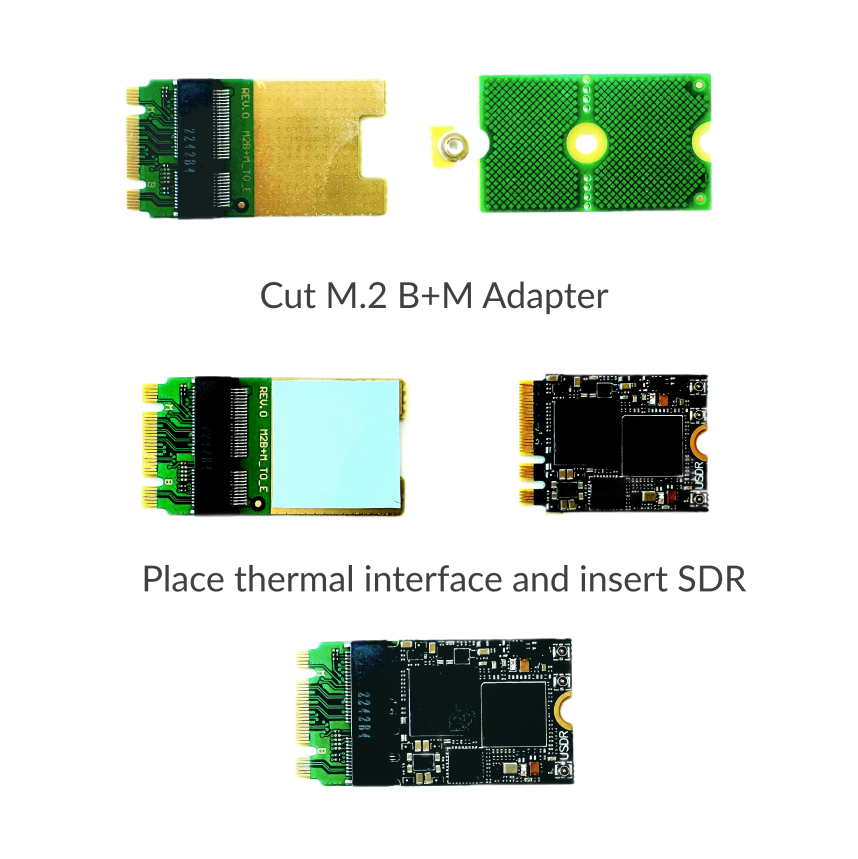

Using Raspberry Pi 5
====================

.. note::
   | To connect uSDR to Rasberry Pi 5 you need to use the MiniPCIe hat and MiniPCIe to M.2 E Key Adapter.
   | Please refer to the :doc:`/hardware/minipcieadapter` document and `M2 HAT+ <https://www.raspberrypi.com/documentation/accessories/m2-hat-plus.html>`_.

.. note::
   | No configuration is required for the USB connection.

How to assemble
^^^^^^^^^^^^^^^^^^

____________________________________

____________________________________

Prepare the system
^^^^^^^^^^^^^^^^^^

Raspberry Pi requires an additional configuration For MiniPCIe.
You have to enable 32-bit DMA and PCIe x1 mode.

.. code-block:: sh

    echo "dtparam=pciex1" | sudo tee -a /boot/firmware/config.txt
    echo "dtoverlay=pcie-32bit-dma" | sudo tee -a /boot/firmware/config.txt
    sudo reboot

Installation
^^^^^^^^^^^^

.. note::
   | Please refer to the :doc:`/software/install` document.

Build from source
^^^^^^^^^^^^^^^^^

.. note::
   | Please refer to the :doc:`/software/compile` document.
