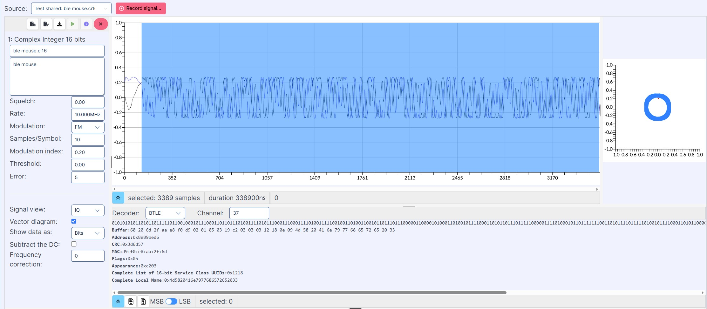

Ready-to-use Applications
=========================

FM Receiver
-----------

**Overview**

The FM Receiver application on WSDR.io allows users to tune into FM radio stations, demodulate signals, and visualize frequency spectrums in real-time.

**Key Features**

- Real-time FM signal reception & demodulation  
- Wide/Narrow FM band selection  
- Adjustable tuning frequency, gain, and sample rate  
- Customizable FFT settings & visualization parameters  
- Waterfall and spectrum display for signal analysis  

**Getting Started**

**Step 1: Open the FM Receiver App**

- Navigate to WSDR.io  
- Click on **Applications**  
- Select **FM Receiver** from the list  
- Click **+** to launch the application  

**Step 2: Select the Signal Source**

- Click the **Source** dropdown  
- Select one of the following:  
  - USB Device (uSDR)  
  - File  
  - Stream  
  - Storage  

**Step 3: Configure Radio Settings**

1. **Set the Frequency**  
   - Adjust the main frequency (e.g., 95.4 MHz)  
   - Use the "Tune Frequency" field for fine-tuning in kHz  

2. **Adjust Bandwidth**  
   - Default: 500 kHz  
   - Larger values provide more signal data  

3. **Configure Gain**  
   - Adjust using the slider (0–24 dB)  

4. **Set the Sample Rate**  
   - Choose a rate (e.g., 1 MHz)  

5. **Select FM Demodulation Mode**  
   - Choose between **WBFM** and **NBFM**  

**Step 4: Adjust Audio Settings**

- Use the volume slider  
- Ensure your system’s audio output is active  

**Step 5: Customize the Visual Display**

1. **Waterfall Spectrum (Left Panel)**  
   - Frequency over time; color indicates signal strength  

2. **Power Spectral Density (Top Right)**  
   - Real-time signal power display  

3. **Demodulated Spectrum (Bottom Right)**  
   - Output of the FM demodulator  

**Step 6: Configure Advanced Parameters**

- **FPS (Frames Per Second)**: Default 20  
- **Alpha Blending**: Default 0.1  
- **FFT & Windowing Options**:  
  - FFT sizes: 1024, 2048, 4096  
  - Window types: Blackman-Harris, Hanning, Hamming  

**Step 7: Start Listening**

- Click **Play**  
- Scroll to adjust frequency  
- Monitor signals in real time  

.. image:: https://img.youtube.com/vi/LFCa-HCUnZI/0.jpg
   :target: https://youtu.be/LFCa-HCUnZI?si=-Yhi9LhrpvB1JkFE
   :alt: Watch on YouTube
   :align: center

🎥 `Watch the video on YouTube <https://youtu.be/LFCa-HCUnZI?si=-Yhi9LhrpvB1JkFE>`__

Cellular Network
----------------

**Overview**

The Cellular Network application enables deployment and control of a **2G GSM network** based on the Osmocom stack. Ideal for development, testing, and research in a cloud-native SDR environment.

**Getting Started**

**Step 1: Interface Overview**

- **Device Selection**: uSDR (via USB or Dev Board)  
- **Configuration Dropdown**: Choose BTS profile  
- **Osmo-BTS Log**: Live BTS operation log  
- **Network Status Bar**:  
  - Shows TX/RX frequencies  
  - Includes mobile connection info  

**Step 2: BTS Configuration**

- Choose from available base station configs  
  - ⚠️ Limited options in current version  
- Config includes:  
  - Band (e.g., GSM900, DCS1800)  
  - ARFCN  
  - Tx/Rx Frequency  

**Step 3: Registering to the Network**

- **Plug in uSDR**  
  - Via USB Adapter or USB-C dev board  

- **Select your Device**  
  - Choose from dropdown  

- **Start the BTS**  
  - Click **Play**  
  - ⚠️ A power cycle is needed if BTS is stopped  

- **Insert Unlocked SIM**  
  - Locked SIMs are not supported  

**On Your Android Device:**

- Navigate to:  
  `Settings → Connections → Mobile networks → Network operators → Scan networks`  
- Select **901-70**  
- Dial `*#100#` to confirm successful registration  

.. image:: https://img.youtube.com/vi/vkWeyYTcMkM/0.jpg
   :target: https://youtu.be/vkWeyYTcMkM?si=eikVXCVtRua4Cy9I
   :alt: Cellular Network – Part 1
   :align: center

🎥 `Watch Cellular Network – Part 1 <https://youtu.be/vkWeyYTcMkM?si=eikVXCVtRua4Cy9I>`__

---

.. image:: https://img.youtube.com/vi/Dtk9X13h_4Y/0.jpg
   :target: https://youtu.be/Dtk9X13h_4Y?si=9I9V5UyJ9hAhJBM1
   :alt: Cellular Network – Part 2
   :align: center

🎥 `Watch Cellular Network – Part 2 <https://youtu.be/Dtk9X13h_4Y?si=9I9V5UyJ9hAhJBM1>`__

Signal Analyzer
---------------

**Overview**

The Signal Analyzer application provides powerful tools for analyzing both digital and analog I/Q signals. It supports multiple modulation types, decoding formats, and visualization modes for signal analysis and protocol inspection.

**Key Features**

- Analyze live or recorded I/Q data  
- Supports FM, GMSK, and FSK modulations  
- Decode BTLE and NRF protocols  
- View multiple signal representations  

**Visualization Modes**

- **I/Q View** – Phase and amplitude scatter  
- **Analog View** – Raw waveform (time-domain)  
- **Power View** – Energy over time  
- **Demodulated View** – Decoded baseband  

**Getting Started**

**Step 1: Open the App**

- Go to **Applications → Signal Analyzer**  
- Click **+** to start a new session  

**Step 2: Choose a Signal Source**

- **Live Stream** – Direct from SDR  
- **Pre-Recorded File** – From PC or Cloud Storage  
- **Shared Stream** – From another application  

**Step 3: Configure Signal Parameters**

- **Sample Rate** – e.g., 100 kHz  
- **Modulation Type** – FM, GMSK, FSK  
- **Samples per Symbol** – e.g., 10  
- **Threshold / Error Settings** – Set decoding tolerance  
- **Modulation Index** – Adjust demodulator behavior  

**Step 4: Select a View Mode**

- IQ View  
- Analog View  
- Power View  
- Demodulated View  

**Step 5: Decode & Analyze**

- Enable **Vector Diagram**  
- Choose **Data Format**: Bits or Symbols  
- Select Decoder:  
  - **BTLE**  
  - **NRF**  
- Set channel (e.g., 37 for Bluetooth)  
- View decoded output in the bottom section  

**Step 6: Save or Export**

- Click **Record Signal** to capture live data  
- Load or save files from Cloud Storage  
- Create new signals from selected portions  

**Additional Notes**

- Always match modulation type with source content  
- Vector diagrams help identify distortions or drift  
- Saved files can be reloaded into other WSDR applications  

.. image:: https://img.youtube.com/vi/rQdlLAFh41I/0.jpg
   :target: https://youtu.be/rQdlLAFh41I?si=CSHWftkV5inXVZNa
   :alt: Signal Analyzer Tutorial
   :align: center

🎥 `Watch the Signal Analyzer tutorial <https://youtu.be/rQdlLAFh41I?si=CSHWftkV5inXVZNa>`__
