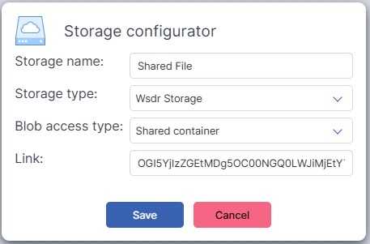

Sharing & Managing SDR Streams
=========================================

The WSDR.io platform provides tools for sharing, storing, and managing SDR data via WebSocket streams and cloud storage.

This section covers:

- **Share Device** – Share your SDR with remote users.
- **Streams** – Manage and reuse SDR data streams.
- **Cloud Storage** – Store and share IQ samples.

1. Share Device
---------------

The **Share Device** app allows you to share your SDR with others via WebSocket.

**Stream Modes:**

- **Controlled** – Remote users can adjust hardware settings (if allowed).
- **Uncontrolled** – Remote users can only receive the stream.

**Steps:**

- Open **Applications**, select **Share Device**.
- Choose an SDR Source (USB device, network stream).
- Configure Parameters (frequency, bandwidth, gain).
- Copy and share the **Device Stream URL** with another users.
- Click **Run** to start streaming.

.. note::
   Any WSDR.io application can generate a stream.
   Streams are received over **WebSocket**.

2. Streams
----------

The **Streams** tab saves incoming SDR streams.

**Steps to Create a Stream:**

- Open **Streams** in the WSDR.io menu.
- Click **Create Stream**.
- Enter a **Name**.
- Paste the **Device Stream URL**.
- Select **Stream Type**:

  - WebSocket (Uncontrolled)

  - WebSocket with Control

- Ensure **Data Type** matches original stream.

.. note::
   Controlled WebSocket streams need a local daemon tool.

   Saved streams are accessible from all WSDR.io applications.

3. Cloud Storage
----------------

Store and share **IQ samples** in the WSDR.io platform.

**Steps:**

- Go to **Cloud Storage**.
- Click **+** to create a container.
- Enter a name and select **Storage Type**:
  - WSDR (internal)
  - Azure (external integration)

- Set **Access Type**:

  - Private Container

  - Shared Container

.. note::
 ‘Private container’ is for your files, and the ‘shared container’ is for the files being shared with you. 

- Create directories, upload files.

**To Share a File:**

- Click **+** to create a share link.

- Send the link to another user.
- They added the link to their shared container in cloud storage.

**To Revoke Access:**

- Disable the shared link.

**Open Files in Applications:**

- Use **Source Selection** in any app.

- If storage isn't visible:

  - Switch to **Edit Mode**

  - Enable **Storages** parameter in SourceSelect block

  - Click **Save**, return to **Play Mode**

.. image:: https://img.youtube.com/vi/fN7Hi8tCTd8/0.jpg
   :target: https://youtu.be/fN7Hi8tCTd8?si=0muutlIL74juImH5
   :alt: Sharing and Managing SDR Streams
   :align: center

🎥 `Watch Sharing and Managing SDR Streams <https://youtu.be/fN7Hi8tCTd8?si=0muutlIL74juImH5>`__

