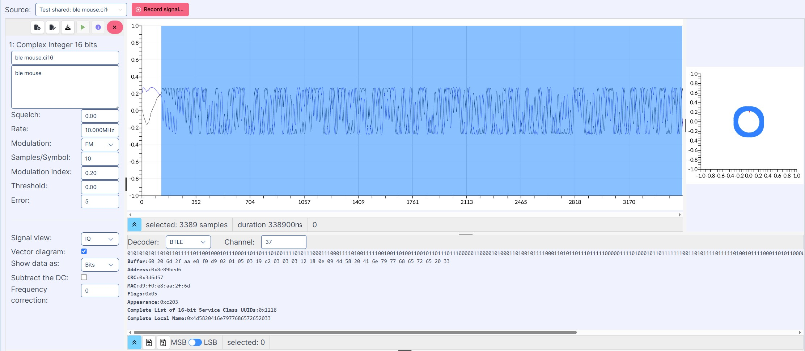

Signal Analyzer
===============

The Signal Analyzer application in WSDR.io allows users to analyze digital and analog signals, supporting multiple modulation types and advanced visualization features. It can process both live signals and pre-recorded files.

1. Features
-----------

WSDR currently supports FM, GMSK, and FSK modulation, with ongoing development for additional modulations.

**Multiple Signal Views:**

- **IQ View** – In-phase & Quadrature representation  
- **Analog View** – Time-domain signal visualization  
- **Power View** – Signal strength over time  
- **Demodulated View** – Extracted baseband signal  

**Current Decoding Options:**

- **BTLE** (Bluetooth Low Energy)  
- **NRF** (Nordic Semiconductor RF protocol)  

**Recording & File Loading:**

- Record a live signal directly from SDR  
- Load a pre-recorded file from a PC or Cloud Storage  

2. Getting Started
------------------

**A. Opening a Signal Source**

- Go to **Applications** and select **Signal Analyzer**  
- Choose a signal source:  
  - **Live Signal** – Direct from SDR device  
  - **Pre-Recorded File** – Load from PC or Cloud Storage  

**B. Configuring Signal Parameters**

- Set the Rate (e.g., 100 kHz)  
- Select Modulation Type (FM, GMSK, or FSK)  
- Adjust Signal Processing Options:  
  - **Samples/Symbol** – Defines signal resolution  
  - **Modulation Index** – Adjusts signal characteristics  
  - **Threshold & Error Settings** – Useful for decoding  

Choose the Signal View:

- IQ View  
- Analog View  
- Power View  
- Demodulated View  

**C. Decoding and Analyzing the Signal**

- Enable **Vector Diagram** to visualize the constellation  
- Select **Data Format**: Bits or Symbols  
- Choose Decoder:  
  - BTLE  
  - NRF  
- Specify the Channel (e.g., 37 for Bluetooth)  
- View the decoded bits in the bottom section  

**D. Recording and Saving Data**

- Click **Record Signal** to start recording live data  
- To load a file, select from PC or Cloud Storage  
- Store analyzed signals in Cloud Storage for later use 

3. Additional Notes
-------------------

- Ensure the correct modulation type is selected for accurate decoding  
- The vector diagram helps visualize signal integrity  
- Cloud Storage Integration allows seamless access across WSDR.io applications  

.. image:: https://img.youtube.com/vi/rQdlLAFh41I/0.jpg
   :target: https://youtu.be/rQdlLAFh41I?si=65RUfWrDmYRZYpTX
   :alt: Signal Analyzer
   :align: center

🎥 `Watch Signal Analyzer Tutorial <https://youtu.be/rQdlLAFh41I?si=65RUfWrDmYRZYpTX>`__
