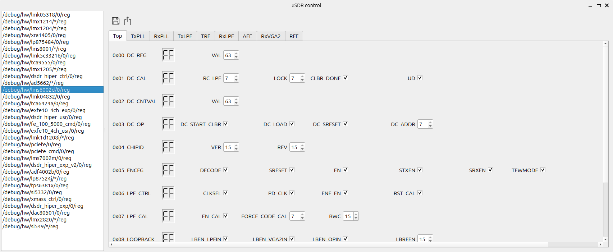

usdr_registers tool
===================

.. note::
   | You have to install ``usdr-tools`` package first.
   | Please refer to the :doc:`/software/install`.

This tool allows you to:

* Control and monitor various internal parameters of your SDR device.
* Control external devices(e.g. analogue front-end).

Overview
--------

The example image below shows the page of LMS6 chip registers control.
Each control of the page corresponds to a specific register of the chip.

.. note::
   | **WARNING!!!**
   | The tool exposes low-level hardware controls.
   | Improper use may lead to unexpected behavior or damage to your hardware.
   | Use with caution and refer to the hardware documentation when necessary.

How to run
----------

In order run the tool, you have to enable the debug mode.
This can be done by setting the environment variable ``USDR_DEBUG`` to ``1`` before executing an application.

.. note::
   | This method can be used with any software that uses SDR via the uSDR library, including those that use the ``SoapySDR`` adapter.

The code below shows how to do this with ``usdr_dm_create`` utility.

.. code-block:: bash

   export USDR_DEBUG=1
   usdr_dm_create -r1e6 -e100e6

The ``usdr_dm_create`` utility should start normally. Debug mode instructs the uSDR library to create the ``usdr_debug_pipe`` named pipe for communication with the ``usdr_registers`` tool.
Now you should open the second terminal window at the same directory when the application was started and run the ``usdr_registers`` tool.

.. code-block:: bash

   usdr_registers

The ``usdr_registers`` tool will connect to the running application via the named pipe and display the control window.

